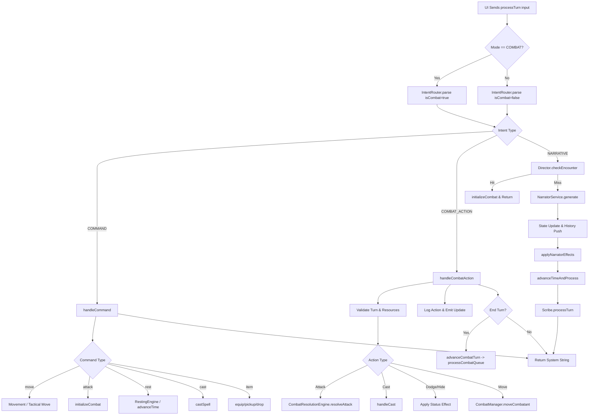
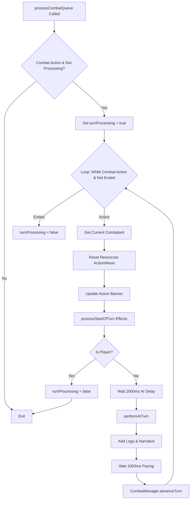

# GameLoop Analysis & Audit

> [!NOTE]
> This document details the features, dependencies, and algorithm flows of the current `GameLoop.ts` to ensure 100% feature parity during refactoring.

## 1. Feature Registry
**Legend**: [C] Combat, [E] Exploration, [S] System, [N] Narrative

1.  **Orchestration**
    - [S] `initialize()`: Bootstraps HexMap, Factions, NPCs, and initial state sync.
    - [S] `processTurn(input)`: Main entry point. Routes `COMMAND` vs `COMBAT_ACTION`.
    - [S] `emitStateUpdate()`: Triggers autosave and notifies UI listeners.
    - [N] `applyNarratorEffects()`: Dispatches mechanical changes suggested by LLM.

2.  **Exploration & Movement**
    - [E] `expandHorizon(coords)`: Programmatic hex discovery (Distance 0, 1, and 2).
    - [E] `handleCommand('move')`: Directional movement (N, NE, etc.), weight check, and time cost.
    - [E] `handleCommand('look')`: Inspects current hex.
    - [E] `handleCommand('pace')`: Toggles travel pace.
    - [E] `seedCoastline()`: Procedural generation trigger.

3.  **Combat Mechanics**
    - [C] `initializeCombat(encounter)`: Sets up grid, combatants, initiative.
    - [C] `handleCommand('attack' / 'combat')`: Manual triggers for combat.
    - [C] `processCombatQueue()`: **THE CORE LOOP**. Orchestrates turn bands, AI delays, and action resets.
    - [C] `handleCombatAction(intent)`: Processes player tactical choices (Attack, Dodge, Hide, Use, Move).
    - [C] `performAITurn(actor)`: Simple AI logic (Move -> Attack).
    - [C] `checkCombatEnd()`: Win/Loss condition evaluation.
    - [C] `endCombat(victory)`: XP, Loot, Level Up, and State Transition.
    - [C] `getTacticalOptions()`: **Public API**. Returns context-aware combat actions for the UI.

4.  **Spellcasting & Abilities**
    - [C] `castSpell(name, target)`: Dedicated entry point for UI spellcasting.
    - [C] `handleCast()`: Combat logic (Targets, Range, Slots, Damage, Concentration).
    - [C] `handleExplorationCast()`: Out-of-combat utility (Heal, Summon).
    - [C] `useAbility()`: Feature usage (Action Surge, Second Wind).
    - [C] `executeSummon()`: Spawns new `summon` type combatants.

5.  **Inventory & Economy**
    - [E] `pickupItem()`: Weight checks, inventory addition.
    - [E] `dropItem()`: Inventory removal, location addition.
    - [E] `equipItem()`: Slot management and AC recalculation.
    - [C] `pickupCombatLoot()`: Post-combat looting logic.
    - [S] `handleCommand('item_add')`: Dev command for item spawning.

6.  **Time & World**
    - [S] `advanceTimeAndProcess()`: Advances clock, triggers Weather, checks Encounters.
    - [S] `completeRest()`: Short/Long rest logic + Ambush checks.
    - [S] `trackTutorialEvent()`: Updates tutorial quest objectives.
    - [N] `unlockLoreCategories()`: Scans narrative text for Codex keywords.

## 2. Dependency Graph

```mermaid
graph TD
    GameLoop --> IntentRouter
    GameLoop --> GameStateManager
    GameLoop --> HexMapManager
    GameLoop --> MovementEngine
    GameLoop --> CombatManager
    GameLoop --> StoryScribe
    GameLoop --> EncounterDirector
    GameLoop --> WorldClockEngine
    GameLoop --> WeatherEngine
    GameLoop --> MechanicsEngine
    GameLoop --> CombatResolutionEngine
    GameLoop --> CombatGridManager
    GameLoop --> DataManager
    GameLoop --> NarratorService
    GameLoop --> NPCService
    GameLoop --> CombatAnalysisEngine
```

## 3. Algorithm Flow: `processTurn`

## 4. Algorithm Flow: `processCombatQueue` (The "Hidden" Loop)

