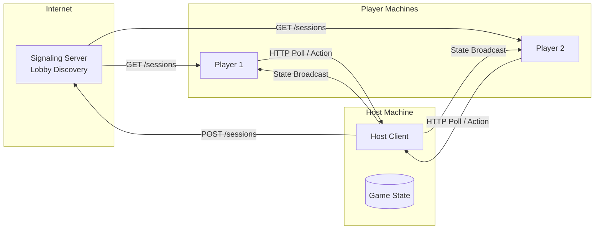
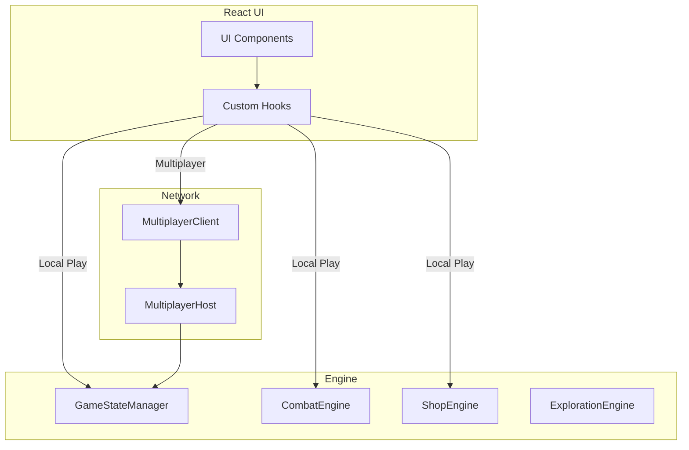
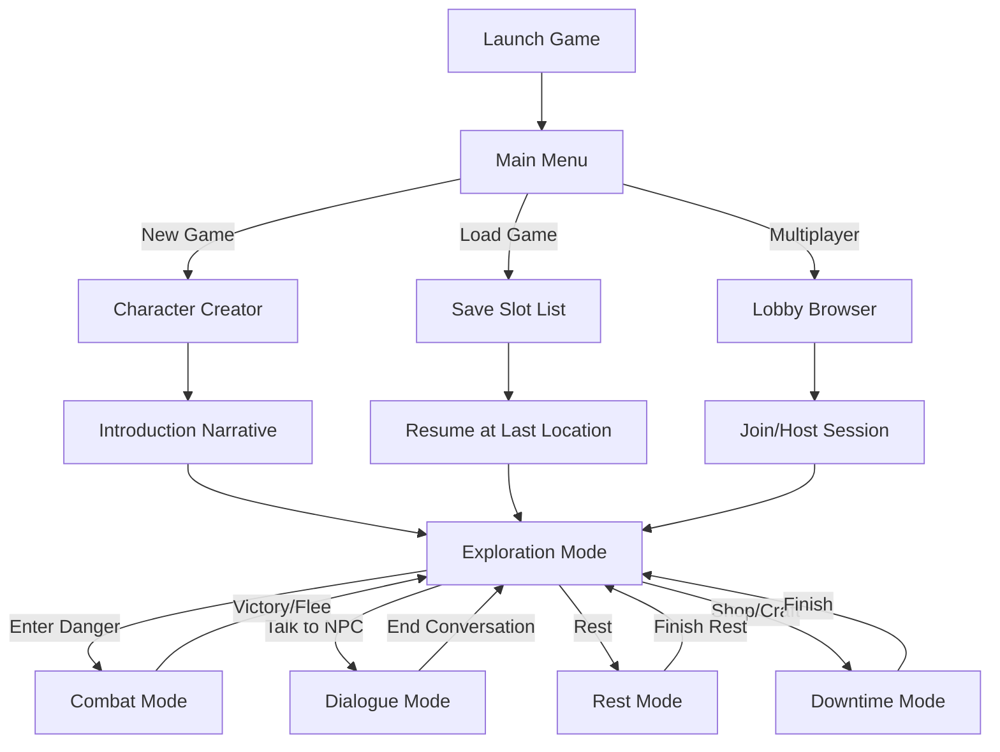

# Analysis & Specification: D&D Lore Engine

## 1. Missing Notions & Specifications (CRITICAL GAPS)

The following elements are absent from current documentation and MUST be explicitly specified for a functional engine.

### A. Core Progression & Economy
*   **Experience Points (XP):** standard 5e leveling table (Level 1-20 XP thresholds) is missing.
    *   *Requirement:* Add standard PHB XP table.
*   **Currency & Wealth:** No definition of CP, SP, EP, GP, PP and their conversion rates.
    *   *Requirement:* Define 1 pp = 10 gp = 20 ep = 100 sp = 1000 cp.
*   **Encumbrance:** Impact of weight (lb) listed in equipment is undefined.
    *   *Requirement:* Define STR * 15 capacity, or Variant Encumbrance rules.

### B. Combat Mechanics
*   **Actions in Combat:** The "standard actions" are referenced (e.g., Rogue Cunning Action mentions Dash/Disengage) but not defined.
    *   *Requirement:* Explicitly define: Attack, Cast a Spell, Dash, Disengage, Dodge, Help, Hide, Ready, Search, Use an Object.
*   **Resting Rules:** "Short Rest" and "Long Rest" are mentioned but not mechanically defined.
    *   *Requirement:* Define Short Rest (1 hour, Hit Dice healing, reset specific resources) and Long Rest (8 hours, full HP, half HD, reset all resources).
*   **Conditions:** Status effects are currently just text strings.
    *   *Requirement:* Explicit mechanics for: Blinded, Charmed, Deafened, Exhaustion (Levels 1-6), Frightened, Grappled, Incapacitated, Invisible, Paralyzed, Petrified, Poisoned, Prone, Restrained, Stunned, Unconscious.

### C. Magic System Detail
*   **Spell Scaling:** "Scales at 5, 11, 17" is noted for cantrips, but Upcasting (casting a Lvl 1 spell at Lvl 2) is inconsistent.
    *   *Requirement:* Each spell must specify "At Higher Levels" behavior explicitly.
*   **Area of Effect (AoE):** Terms like "Cone", "Cube", "Line" are used but their grid logic is undefined.
    *   *Requirement:* Define geometry for grid mapping (e.g., 5-3-5 rule or templates).
*   **Components:** V, S, M are tags, but "M" (Material) often requires specific costs (e.g., Revivify 300gp diamond).
    *   *Requirement:* Explicitly list costly material components for consumption logic.

## 2. Inconsistencies & Data Verification

### A. The "Dragonborn" & Lore Issue
*   **Observation:** The document lists "Standard D&D 5th Edition races" and includes Dragonborn.
*   **Conflict:** User requested to "Correct... inclusion of Dragonborn in classical D&D lore".
*   **Verdict:** User has decided to **Tag as Optional**.
*   **Action:** Tag Dragonborn in all data/docs with `[Optional: Exotic]`. They will be preserved but filtered out depending on campaign settings.

### B. Subclass & Feature alignment
*   **Cleric Domains:** "Tempest" and "War" are PHB but not SRD (Open Game License).
*   **Missing SRD Feats:** "Actor" and "Athlete" are not SRD.
*   **Verdict:** User confirmed **Personal Use**, so we will **Keep All Content** regardless of SRD status.
*   **Correction:** "History... lore per se" will be clarified.

### C. Logic gaps
*   **Human Variant:** Is the only place "Feat" is mentioned as a level 1 option. Standard rules usually allow Feats instead of ASI at level 4+. This needs global implementation, not just Human Variant.

## 3. VibeCoding Strategy: Structured & Hallucination-Proof

To ensure future development is organized, strictly typed, and error-proof, we will move from "Markdown as Source" to "Code/Schema as Source".

### A. The "Schema-First" Approach
Instead of parsing Markdown (which is prone to typos/hallucination), we define **Zod Schemas** or **TypeScript Interfaces** for every entity.
*   **Why?** TS enforces that a [Spell](file:///d:/coding/rpg_NEW/src/ruleset/combat/SpellcastingEngine.ts#24-55) *must* have a `castingTime`, `range`, `components`, etc. LLMs are excellent at filling clear JSON structures but bad at maintaining consistent free-text formatting.
*   **Implementation:**
    1.  Define `schemas/Spell.ts`, `schemas/Class.ts`, `schemas/Monster.ts`.
    2.  Data lives in `data/spells.json` or `data/spells.ts` (Typed arrays).
    3.  Markdown documentation is **Generated** from this data (Read-Only View).

### B. Decision Path for New Content
1.  **Define the Type:** "I need a new Monster." -> Look at `Monster` interface.
2.  **Fill the Data:** Create a structured object matching the interface.
3.  **Validate:** Run a script `npm run validate-data`. It checks:
    *   Are all referenced spells real? (Foreign Key check)
    *   Are stats valid? (STR 1-30)
    *   Calculated fields correct? (XP matches CR? HP matches Hit Dice?)
4.  **Generate Docs:** Run `npm run docs:gen` to update the Markdowns for readability.

### C. Hallucination Proofing
*   **Strict Enums:** Damage types (`Fire`, `Cold`) are Enums, not strings. "Fyre" will throw a compile error.
*   **Cross-Referencing:** If a Class Feature says "Grants *Fireball*", the validator ensures *Fireball* exists in `spells.ts`.
*   **Atomic Definitions:** No "See standard rules" comments. Every rule is a function or data point.

## 4. Content Architecture & Strategy (Addressing Scope)

To solve the "Only 12 Enemies" and "Missing Items" problem without manually writing 1,000 files:

### A. Strict vs. Flexible Data
We will split our data strategy into two tiers:
1.  **Strict Data (Gameplay Critical):**
    *   **Scope:** Weapons, Armor, Spells, Monsters, **AND Magic Items**.
    *   **Definition:** Anything that alters stats, grants spells, or has a specific mechanical action.
    *   **Examples:** *Ring of Protection* (+1 AC), *Amulet of Health* (SET CON 19), *Wand of Magic Missiles*.
    *   **Schema:** These will use a `MagicItem` schema with a `modifiers` array (e.g., `{ type: "stat_bonus", stat: "AC", value: 1 }`).
    *   **Source:** SRD Import + Manual Entry for custom artifacts.

2.  **Flexible Data (The "Fluff" Layer):**
    *   **Scope:** **Mundane** Jewelry, Regular Clothing, Art Objects, Trade Goods.
    *   **Definition:** Items with NO utility beyond flavor or gold value.
    *   **Examples:** *Gold Ring with Ruby* (Value: 50gp, Effect: None), *Fine Silk Robe*.
    *   **Schema:** `GenericItem` schema (Name, Value, Weight, Description, Tags).
    *   **LLM Freedom:** The LLM can generate infinite "Gold Rings" with different descriptions, but it cannot generate a "Ring of Fireball" unless it uses the Strict Schema.

### B. The SRD Import Plan
Instead of manually typing every potion:
1.  **Phase 3 Task:** "Ingest SRD Text".
2.  **Mechanism:** We will run a script to parse open-source 5e SRD text files and convert them into our JSON/TS format.
3.  **Result:** Instant access to ~300 Monsters and standard Magic Items (Potions, Rings) that *do* have gameplay effects.

## 5. Outcomes & Deliverables

To clearly answer "What is the outcome?": The goal is to transform a "Text-Based Wiki" into a "Type-Safe Game Database".

### Deliverable 1: The "Codebase of Truth"
A new directory structure (`/src/ruleset/`) containing:
1.  **Zod Schemas**: Strict definitions of what a "Class", "Spell", or "Monster" is.
    *   *Example:* `schemas/SpellSchema.ts` ensures every spell has a valid Component list and School.
2.  **Structured Data Files**: TypeScript files containing the actual content.
    *   *Benefit:* Autocomplete in your IDE, compile-time error checking (e.g., "Fireball cannot deal 'Fyre' damage").
3.  **Validation Scripts**: A command `npm run verify-lore` that checks for missing references.

### Deliverable 2: Corrected Documentation
We will patch the current Markdown docs to fill the identifying missing gaps immediately, serving as a human-readable reference for the data entry.
*  - **New File:** `refs/Mechanics_Master.md` (XP Tables, Conditions, Resting).
- **Updated File:** `refs/Races.md` (Dragonborn tagged as Optional).
- **New File:** `ARCHITECTURE.md` (High-level technical overview of the VibeCoding structure).

### Deliverable 3: "Hallucination-Proof" Workflow
A documented process for adding new content:
> **New Monster?** Don't write a paragraph. Create a `new Monster({ ... })` object. The TypeScript compiler will yell at you if you forget the `AC` or give it an invalid `CR`.

## 6. Phase 4: Expansion & Documentation (NEW)

### A. Documenting the "VibeCoding" Architecture
We will create a definitive `ARCHITECTURE.md` that explains:
*   The **Single Source of Truth** (`data/` directory).
*   The **Validation Layer** (`src/ruleset/schemas/`).
*   The **Ingestion Workflow** (Mapping SRD data to internal schemas).
*   The **Documentation Sync** (Markdown files as views of the data).

### B. Completing the Game Database
We will ingest the missing core entities to ensure a full PHB/SRD experience:
*   **Classes & Subclasses**: 1-20 progression, hit dice, proficiencies.
*   **Races & Subraces**: Racial traits, ability modifiers, size, speed.
*  - **Features & Traits**: Mapping class features and racial traits to structured objects.

## 7. Phase 6: Combat Simulation Engine (NEW)

### A. Core Combat Logic
We will implement a deterministic combat engine that translates SRD data into fight outcomes.
*   **Initiative Manager**: Handles DEX-based turn order and surprise rounds.
*   **Attack Resolver**: 
    *   Calculates `d20 + modifiers` vs `AC`.
    *   Handles critical hits (natural 20).
    *   Applies Advantage/Disadvantage flags.
*   **Damage Processor**:
    *   Resolves weapon and spell damage dice.
    *   Subtracts HP and applies damage resistances/vulnerabilities.
*   **State Tracker**: Manages combatant HP, temporary HP, and conditions (Blinded, Prone, etc.).

### B. Participant Context
*   **Unified Actor Interface**: A common structure for both `Character` and `Monster` to allow the engine to treat them identically in combat.
*   **Action Economy Enforcement**: Tracking Action, Bonus Action, and Reaction usage per turn.

## 8. Phase 7: Logic Core Expansion (Strict Mechanics)
Before we bring in the AI, the deterministic engine must be complete.
*   **Skill Check System**: `d20 + Mod + Prof` vs `DC`.
*   **Saving Throw System**: Handling spell/trap resistance.
*   **Resting & Recovery**: Short/Long rest logic (Hit Dice, Spell Slot restoration).
*   **Inventory & Encumbrance**: Managing weight, capacity, and `Item` definitions.

## 9. Phase 8: The Brain (LLM Agent Swarm)
Implementing the "Hybrid Intelligence" layer from the Master Design Document.
*   **Agent Interfaces**: `Narrator`, `Director`, `Scribe`, `NPC_Controller`.
*   **ICP (Internal Communication Protocol)**: Implementing the strict JSON interfaces for LLM Input/Output.
*   **Context Management**: Managing token windows and history summarization.

## 10. Phase 9: The Game Loop (Wiring it together)
Connecting the Logic Layer and Agent Layer.
*   **Intent Router**: Distinguish between "Talk", "Combat Action", and "System Command".
*   **Turn Lifecycle**: `Input -> Logic -> Agent -> State Update -> Output`.
*   **State Persistence**: Auto-saving the `GameState` (Characters, Map, Story) to JSON after every turn.

## 11. Phase 10: Character Creation & Backgrounds
*Prerequisites: Player schema exists. Must be completed before gameplay can begin.*

### A. Character Creation Wizard
*   **Flow:** Race → Class → Ability Scores → Background → Equipment → Name.
*   **Ability Score Methods:** Point-buy (27 points), Standard Array, 4d6-drop-lowest.
*   **Racial Modifiers:** Apply +2/+1 or custom based on race.

### B. Background System
*   **Schema:** `BackgroundSchema` (Acolyte, Criminal, Soldier, etc.).
*   **Grants:** 2 skill proficiencies, tool proficiencies, starting equipment, feature.
*   **Personality Traits:** Bond, Ideal, Flaw for LLM context.

### C. Starting Equipment
*   **Logic:** Class + Background provide default gear.
*   **Alternative:** Gold roll for custom purchases.

---

## 12. Phase 11: World Enrichment & NPCs
*Prerequisites: Hex Map exists.*

### A. Sub-Location System
*   **Schema:** `SubLocationSchema` for dungeons, buildings, caves, city districts.
*   **Rooms:** `RoomSchema` with exits, descriptions, entities.
*   **Navigation:** `GameState.location` switches from hex-based to room-based when entering POI.

### B. NPC System (Non-Companions)
*   **Schema:** `WorldNPCSchema` (innkeepers, merchants, quest-givers).
*   **Storage:** NPCs live in `POI.entities[]` or `Hex.entities[]`.
*   **Disposition:** Friendly, Neutral, Hostile. Changes based on social checks.

### C. Environmental Hazards
*   **Types:** Lava (fire dmg), Cold (exhaustion), Water (drowning CON saves), Falling (1d6 per 10ft).
*   **Triggers:** Hex/room property or Narrator directive.

### D. Light & Darkness
*   **States:** Bright, Dim (disadvantage Perception), Darkness (blinded without darkvision).
*   **Darkvision:** Racial trait allows dim light vision.

---

## 13. Phase 12: Game Mode & Time Management
*Prerequisites: Intent Router exists.*

### A. Game Mode State Machine
*   **Enum:** `EXPLORATION`, `DIALOGUE`, `COMBAT`, `REST`, `SHOP`, `CHARACTER_CREATION`.
*   **Transitions:** Triggered by IntentRouter, DirectorAgent, or system events.
*   **Combat Entry:** `/attack`, hostile NPC, or Narrator `[INITIATIVE]` directive.
*   **Combat Exit:** All enemies dead/fled, or party fled.

### B. World Clock
*   **Schema:** `WorldClock` { hour: 0-23, day: 1-30, month: 1-12, year: number }.
*   **Travel Time:** Hex movement costs hours based on terrain.
*   **Resting:** Short rest = 1 hour, Long rest = 8 hours.
*   **Time-Based Events:** Scheduled triggers (e.g., "At midnight...").

---

## 14. Phase 13: Combat Mechanics Expansion
*Prerequisites: Basic combat engine exists.*

### A. Tactical Combat
*   **Opportunity Attacks:** Reaction when enemy leaves melee range.
*   **Cover System:** Half (+2 AC), Three-quarters (+5 AC), Full (untargetable).
*   **Ranged in Melee:** Disadvantage when hostile within 5ft.
*   **Flanking (Optional):** Advantage when ally opposite the target.

### B. Special Actions
*   **Grappling:** Contested Athletics vs Athletics/Acrobatics. Target grappled.
*   **Shoving:** Knock prone or push 5ft.
*   **Two-Weapon Fighting:** Bonus action attack with light off-hand weapon (no mod to damage).

### C. Stealth & Perception
*   **Group Stealth:** Average check for party.
*   **Passive Perception:** 10 + WIS mod + proficiency.
*   **Surprise Round:** Unaware combatants skip first round.

---

## 15. Phase 14: Loot, Equipment & Economy
*Prerequisites: Combat exists, items exist, weapon_action_mapping.json generated.*

> [!IMPORTANT]
> This phase implements the complete loot and economy system. Key data files already generated:
> - `data/mappings/weapon_action_mapping.json` (41 action→item mappings)
> - `data/mappings/natural_attacks.json` (144 non-droppable attacks)

---

### A. Currency System (`CurrencyEngine`)

#### A.1 Currency Schema
```typescript
CurrencySchema = {
    cp: number,  // Copper pieces
    sp: number,  // Silver pieces
    ep: number,  // Electrum pieces
    gp: number,  // Gold pieces
    pp: number   // Platinum pieces
}
```

#### A.2 Conversion Rates (SRD Standard)
| From | To | Rate |
|------|-----|------|
| 1 pp | → gp | 10 |
| 1 gp | → sp | 10 |
| 1 gp | → ep | 2 |
| 1 sp | → cp | 10 |
| **Total:** 1 pp = 10 gp = 20 ep = 100 sp = 1000 cp |

#### A.3 Currency Methods
- `CurrencyEngine.toCopper(currency: Currency): number` - Convert any currency to total copper value.
- `CurrencyEngine.normalize(currency: Currency): Currency` - Simplify (e.g., 150cp → 1gp 5sp 0cp).
- `CurrencyEngine.add(a: Currency, b: Currency): Currency` - Combine currencies.
- `CurrencyEngine.subtract(a: Currency, b: Currency): Currency | null` - Returns null if insufficient funds.
- `CurrencyEngine.canAfford(wallet: Currency, cost: Currency): boolean`

---

### B. Loot Drop System (`LootEngine`)

#### B.1 Equipment Drops (Weapons & Armor)

**Weapon Drops (Data-Driven):**
1. Load `data/mappings/weapon_action_mapping.json` at startup.
2. On enemy defeat, check if `monster.type` is droppable (`humanoid`, `giant`, `undead`, `fiend`, `celestial`).
3. For each action in `monster.actions`, lookup in weapon mapping → add to loot.

**Armor Drops (AC-Based Inference):**
| Monster AC | Inferred Armor | Item Drop |
|------------|----------------|----------|
| 10-12 | No armor / Natural | None |
| 13-14 | Leather / Studded Leather | `Leather.json` |
| 15-16 | Chain Shirt / Scale Mail | `Chain_Shirt.json` |
| 17-18 | Half Plate / Splint | `Half_Plate.json` |
| 19+ | Plate | `Plate.json` |

> Only applies to `humanoid` and `giant` types. Beasts/monstrosities have natural armor (no drop).

#### B.2 Treasure Drops (CR-Based Tables)

**Tier System:**
| Tier | CR Range | Gold Roll | Bonus Item Chance | Item Value Max |
|------|----------|-----------|-------------------|----------------|
| 0 | 0 - 1/4 | 1d6 cp | 5% | 1 sp |
| 1 | 1/2 - 1 | 2d6 sp | 15% | 5 sp |
| 2 | 2 - 4 | 3d6 gp | 25% | 5 gp |
| 3 | 5 - 10 | 4d6 × 10 gp | 40% | 50 gp |
| 4 | 11 - 16 | 5d6 × 100 gp | 60% | 500 gp |
| 5 | 17+ | 6d6 × 1000 gp | 80% | 5000 gp |

**Bonus Item Selection:**
1. Roll percentile for item chance.
2. If successful, query items where `cost ≤ tierMaxValue`.
3. Randomly select from eligible items.

#### B.3 LootEngine Methods
```typescript
LootEngine.getEquipmentDrops(monster: Monster): Item[]
LootEngine.getTreasureDrops(cr: number): { gold: Currency, items: Item[] }
LootEngine.processDefeat(monster: Monster): LootResult
LootEngine.transferToPlayer(player: PlayerCharacter, loot: LootResult): void
```

---

### C. Equipment Slot System

#### C.1 Equipment Slots Schema
```typescript
EquipmentSlotsSchema = {
    head: ItemId | null,
    armor: ItemId | null,
    cloak: ItemId | null,
    hands: ItemId | null,
    ring1: ItemId | null,
    ring2: ItemId | null,
    feet: ItemId | null,
    mainHand: ItemId | null,
    offHand: ItemId | null,
    ammunition: ItemId | null
}
```

#### C.2 Equip Logic
- `equipItem(player, slot, itemId)` - Validates slot compatibility, applies modifiers.
- `unequipItem(player, slot)` - Removes modifiers, returns item to inventory.
- **AC Calculation:** BaseAC (10 + DEX) + armor bonus + shield bonus + magic modifiers.

---

### D. Shop & Services System

#### D.1 Shop Mode
- **Entry:** Player interacts with merchant NPC → `GameMode.SHOP`.
- **Buy:** Item cost deducted from player currency.
- **Sell:** Items sold at 50% of `item.cost` value.
- **Negotiate:** A Charisma (Persuasion) check against the merchant's passive Insight (or a fixed DC based on merchant quality). Success reduces buy prices / increases sell prices by 10-20%. Failure may offend the merchant, closing the shop for a period.

#### D.2 Services
| Service | Cost | Effect |
|---------|------|--------|
| Inn (Common) | 5 sp/night | Safe long rest |
| Inn (Comfortable) | 8 gp/night | Long rest + inspiration |
| Healing | 5 gp/HP | Restore HP outside rest |
| Identify | 20 gp | Reveal magic item properties |
| Resurrection | 1000 gp | Requires 7th level cleric |

---

### E. Magic Item Identification & Attunement

#### E.1 Identification
- **Unidentified State:** Magic items have `identified: false`. Properties hidden.
- **Methods:** Short rest (1 hour study) OR `Identify` spell OR pay for service.

#### E.2 Attunement
- **Max Attuned:** 3 items per character.
- **Process:** Short rest focusing on item.
- **Tracking:** `player.attunedItems: ItemId[]`.

---

### F. Implementation Checklist

1. **[NEW] `CurrencyEngine.ts`** - Currency math and conversions.
2. **[NEW] `LootEngine.ts`** - Drop resolution (weapons, armor, treasure).
3. **[NEW] `data/mappings/armor_ac_mapping.json`** - AC→Armor inference table.
4. **[NEW] `data/mappings/loot_tiers.json`** - CR-based treasure table config.
5. **[MODIFY] `PlayerCharacterSchema.ts`** - Add `equipmentSlots` and `attunedItems`.
6. **[NEW] `EquipmentEngine.ts`** - Equip/unequip logic with modifier application.
7. **[NEW] `ShopEngine.ts`** - Buy/sell/negotiate logic.
8. **[NEW] `simulate_loot.ts`** - Verification script.

---

## 16. Phase 15: Magic System Expansion
*Prerequisites: Spell schema exists, PlayerCharacterSchema exists.*

> [!IMPORTANT]
> This phase introduces full spellcasting mechanics for players, companions, and monsters. It covers learning, preparation, ritual casting, and combat use of spells.

---

### A. Ritual Spells (Schema Update)

**Schema Change:** Add `ritual: z.boolean().default(false)` to `SpellSchema.ts`.

**Ritual Spells List (SRD):** The following spells should have `"ritual": true` added:

| Spell Name | Level | School |
|------------|-------|--------|
| Alarm | 1 | Abjuration |
| Comprehend Languages | 1 | Divination |
| Detect Magic | 1 | Divination |
| Detect Poison and Disease | 1 | Divination |
| Find Familiar | 1 | Conjuration |
| Identify | 1 | Divination |
| Illusory Script | 1 | Illusion |
| Purify Food and Drink | 1 | Transmutation |
| Speak with Animals | 1 | Divination |
| Unseen Servant | 1 | Conjuration |
| Animal Messenger | 2 | Enchantment |
| Augury | 2 | Divination |
| Gentle Repose | 2 | Necromancy |
| Locate Animals or Plants | 2 | Divination |
| Silence | 2 | Illusion |
| Water Breathing | 3 | Transmutation |
| Water Walk | 3 | Transmutation |
| Commune | 5 | Divination |
| Commune with Nature | 5 | Divination |
| Contact Other Plane | 5 | Divination |
| Rary's Telepathic Bond | 5 | Divination |
| Forbiddance | 6 | Abjuration |

**Ritual Casting Rule:** A spell with `ritual: true` can be cast without expending a slot if cast with +10 minutes to casting time. The caster must have the spell prepared (or in spellbook for Wizards).

---

### B. Spell Knowledge & Preparation System

#### B.1 Schema Changes (`PlayerCharacterSchema.ts`)

```typescript
// Add to PlayerCharacterSchema:
cantripsKnown: z.array(z.string()).default([]),     // Always available, no slots
knownSpells: z.array(z.string()).default([]),       // Bard, Sorcerer, Ranger, etc.
preparedSpells: z.array(z.string()).default([]),    // Active spells for the day
spellbook: z.array(z.string()).default([])          // Wizard only (max 100 spells)
```

#### B.2 Spell Learning by Class Type

| Class Type | Learning Method | Preparation |
|------------|-----------------|-------------|
| **Learned Casters** (Bard, Sorcerer, Ranger, Warlock) | Learn on level-up based on class table | Cast from `knownSpells` directly |
| **Prepared Casters** (Cleric, Druid) | Know ALL class spells | Prepare (WIS/CHA mod + level) spells daily |
| **Spellbook Casters** (Wizard) | Start with 6 spells, +2 per level | Prepare (INT mod + level) from `spellbook` |

#### B.3 Wizard Spellbook Mechanics

- **Capacity:** 100 pages (1 page per spell level, so a 9th-level spell = 9 pages).
- **Copying a Spell:** Requires a **Spell Scroll** item OR another wizard's spellbook.
  - **Time:** 2 hours per spell level.
  - **Cost:** 50gp per spell level (scribing materials).
  - **Success:** Automatic (no check needed in 5e for same-class spells).

---

### C. Spell Scroll Item Type

> [!IMPORTANT]
> To enable "copy spell to spellbook", we must create the `Spell Scroll` item type.

#### C.1 New Item Schema (`SpellScrollSchema`)

```typescript
SpellScrollSchema = BaseItemSchema.extend({
    type: z.literal('Spell Scroll'),
    spellName: z.string(),          // e.g., "Fireball"
    spellLevel: z.number().min(0).max(9),
    consumedOnUse: z.boolean().default(true)
});
```

**Properties:**
- A scroll can be **used directly** (casts the spell once, scroll is consumed).
- A scroll can be **copied to a spellbook** (scroll is consumed, spell is added to `spellbook`).
- **Usage Restrictions:** If the spell is not on the user's class list, an Arcana check is required (DC 10 + spell level).

#### C.2 Example Spell Scroll

```json
{
    "name": "Spell Scroll: Fireball",
    "type": "Spell Scroll",
    "spellName": "Fireball",
    "spellLevel": 3,
    "cost": { "cp": 0, "sp": 0, "ep": 0, "gp": 200, "pp": 0 },
    "weight": 0,
    "consumedOnUse": true,
    "description": "A scroll containing the spell Fireball. Can be cast directly or copied to a spellbook."
}
```

---

### D. Spellcasting in Combat (`SpellcastingEngine.ts`)

#### D.1 Combat State Changes

**`CombatFactory`** must copy spell data to `CombatantState`:
```typescript
spellSlots: { '1': { current: 4, max: 4 }, '2': { current: 3, max: 3 }, ... },
preparedSpells: [ 'Fireball', 'Shield', 'Counterspell' ],
concentration: null | { spellName: string, startTurn: number }
```

#### D.2 `SpellcastingEngine` Methods

| Method | Description |
|--------|-------------|
| `canCast(caster, spellName, slotLevel)` | Validates: spell is prepared, slot is available, components are met. |
| `castSpell(caster, target, spellName, slotLevel)` | Deducts slot, resolves effect, sets concentration if needed. |
| `breakConcentration(caster)` | Ends the active concentration spell. |
| `concentrationCheck(caster, damageTaken)` | CON save DC = max(10, damage/2). Failure = break concentration. |

#### D.3 Monster Spellcasting

Monsters with spellcasting (e.g., Mage, Lich) have `spellcasting` in their actions. The engine should:
1. Parse the action text for spell list and slot usage.
2. Create a pseudo-`preparedSpells` array from the action.

---

### E. Monster Spellcasting (Structured Data)

> [!IMPORTANT]
> The 12 spellcaster monsters currently have spellcasting defined in plain text. This must be converted to structured data for combat AI and loot generation.

#### E.1 Spellcaster Monsters (12 total)

| Monster | CR | Caster Level | Ability | Class |
|---------|-----|--------------|---------|-------|
| Acolyte | 0.25 | 1st | WIS | Cleric |
| Cult Fanatic | 4 | 4th | WIS | Cleric |
| Priest | 2 | 5th | WIS | Cleric |
| Druid | 2 | 4th | WIS | Druid |
| Mage | 6 | 9th | INT | Wizard |
| Archmage | 12 | 18th | INT | Wizard |
| Lich | 21 | 18th | INT | Wizard |
| Mummy Lord | 15 | 10th | WIS | Cleric |
| Androsphinx | 17 | 12th | WIS | Cleric |
| Gynosphinx | 11 | 9th | INT | Wizard |
| Guardian Naga | 10 | 11th | WIS | Cleric |
| Spirit Naga | 8 | 10th | INT | Wizard |

#### E.2 New Schema Field (`MonsterSchema`)

Add optional `spellcasting` field to `MonsterSchema`:

```typescript
spellcasting: z.object({
    casterLevel: z.number(),
    ability: AbilityScoreSchema,         // INT, WIS, or CHA
    spellSaveDC: z.number(),
    spellAttackBonus: z.number(),
    atWill: z.array(z.string()).optional(),  // Spells castable at will
    cantrips: z.array(z.string()).default([]),
    slots: z.record(z.string(), z.object({
        count: z.number(),
        spells: z.array(z.string())
    })).default({})
}).optional()
```

#### E.3 Example Structured Data (Acolyte)

```json
{
    "spellcasting": {
        "casterLevel": 1,
        "ability": "WIS",
        "spellSaveDC": 12,
        "spellAttackBonus": 4,
        "cantrips": ["light", "sacred flame", "thaumaturgy"],
        "slots": {
            "1": { "count": 3, "spells": ["bless", "cure wounds", "sanctuary"] }
        }
    }
}
```

#### E.4 One-Time Data Migration Script

Create `analyze_monster_spellcasting.ts` to:
1. Parse the `Spellcasting` trait text using regex
2. Extract: caster level, ability, DC, attack bonus, spell lists
3. Generate the structured `spellcasting` field
4. Output updated monster JSON files

**Parsing Pattern:**
```
"The {monster} is a {level}-level spellcaster. Its spellcasting ability is {ability} 
(spell save DC {dc}, +{bonus} to hit with spell attacks)..."
"- Cantrips (at will): {spell1}, {spell2}, ..."
"- {N}st/nd/rd/th level ({slots} slots): {spell1}, {spell2}, ..."
```

#### E.5 Spell Scroll Drops from Spellcasters

When a spellcaster monster is defeated:
1. Get their `spellcasting.slots` data
2. For each spell level ≥ 1, there's a 20% chance per spell to drop a scroll
3. `LootEngine.generateSpellScroll(spellName, spellLevel)` creates the item

---

### F. Implementation Checklist

1. **[MODIFY] `SpellSchema.ts`** - Add `ritual: z.boolean().default(false)`.
2. **[DATA] 22 Spell JSON files** - Add `"ritual": true` (see list in Section A).
3. **[MODIFY] `PlayerCharacterSchema.ts`** - Add `cantripsKnown`, `knownSpells`, `preparedSpells`, `spellbook`.
4. **[NEW] `SpellScrollSchema` in `ItemSchema.ts`** - New item discriminant.
5. **[MODIFY] `MonsterSchema.ts`** - Add optional `spellcasting` structured field.
6. **[NEW] `analyze_monster_spellcasting.ts`** - One-time migration script.
7. **[DATA] 12 Monster JSON files** - Add structured `spellcasting` field.
8. **[NEW] `SpellcastingEngine.ts`** - Core casting logic.
9. **[MODIFY] `CombatFactory.ts`** - Copy spell data to combatant state.
10. **[NEW] `StandardActions.castSpell()`** - Combat action.
11. **[NEW] `SpellbookEngine.ts`** - Learn/copy/prepare spells.
12. **[MODIFY] `LootEngine.ts`** - Add `generateSpellScroll()` and spellcaster drop logic.
13. **[NEW] `simulate_spellcasting.ts`** - Verification script.

---


## 17. Phase 16: LLM Provider Configuration
*Prerequisites: Agent architecture exists. MUST be completed before Agent Activation.*

> **IMPORTANT NOTE:** The model names listed below are current as of early 2025. The actual API call identifiers (e.g., `gemini-3.0-flash`) MUST be verified via official documentation before implementation, as they may differ from marketing names.

### A. Provider Registry Schema
```typescript
LLMProviderSchema = {
    id: string,             // e.g., "gemini", "openai", "anthropic", "openrouter"
    name: string,           // Display name
    apiKeyEnvVar: string,   // e.g., "GEMINI_API_KEY"
    baseUrl: string,        // API endpoint
    models: ModelSchema[]
}

ModelSchema = {
    id: string,             // Internal identifier
    apiName: string,        // Actual API call name (VERIFY BEFORE CODING)
    displayName: string,    // UI display
    contextWindow: number,  // Max tokens
    costPer1kTokens: number // For budget tracking
}
```

### B. Default Providers & Models

**Gemini (Google):**
| Model | API Name (VERIFY) | Notes |
|---|---|---|
| Gemini 3.0 Flash | `gemini-3.0-flash` | Default. Fast, cheap. |
| Gemini 3.0 Pro | `gemini-3.0-pro` | Higher quality. |

**OpenAI:**
| Model | API Name (VERIFY) | Notes |
|---|---|---|
| GPT-5.2 Instant | `gpt-5-2-instant` | The 2026 standard for fluid, adaptive narration. |
| GPT-5.2 Thinking | `gpt-5-2-thinking` | Advanced reasoning for complex plot continuity. |
| GPT-5 mini | `gpt-5-mini` | Optimized for speed and cost-efficiency. |

**Anthropic (Claude):**
| Model | API Name (VERIFY) | Notes |
|---|---|---|
| Claude 4.5 Haiku | `claude-4-5-haiku` | Fastest, cheapest Claude for snappy dialogue. |
| Claude 4.5 Sonnet | `claude-4-5-sonnet` | Balanced quality/cost for general narration. |
| Claude 4.5 Opus | `claude-4-5-opus` | Premium intelligence for deep world-building. |

**OpenRouter (Aggregator):**
| Model | API Name (VERIFY) | Notes |
|---|---|---|
| Mistral 7B | `mistralai/mistral-7b-instruct` | Very cheap. |
| Llama 3 8B | `meta-llama/llama-3-8b-instruct` | Open source. |
| Nous Hermes 2 | `nousresearch/nous-hermes-2-mixtral` | Good for RP. |
| Gemma 2 9B | `google/gemma-2-9b-it` | Google open-weight. |
| Qwen 2 7B | `qwen/qwen-2-7b-instruct` | Efficient. |

### C. Custom Model Registration
*   **UI (Future):** Add new models via settings panel.
*   **Storage:** `data/config/llm_providers.json` for persistence.
*   **Validation:** Test API call on save.

---

## 18. Phase 17: Agent Activation (Full LLM Integration)
*Prerequisites: LLM Provider Config complete.*

### A. NPC Controller Agent
*   **Role:** Simulates companion behavior.
*   **Input:** Party state, scene, companion personalities.
*   **Output:** Companion dialogue/action suggestions.

### B. Scribe Trigger
*   **Frequency:** Every N turns (configurable, default 20).
*   **Output:** Summary appended to `story_summary.md`.
*   **Action:** Truncate active history to last 5 turns.

### C. Director Pacing
*   **Logic:** Analyze last 20 turns for engagement score.
*   **Encounters Table:** `data/encounters/` JSON by biome/difficulty.
*   **Output:** Directive to Narrator (e.g., `[DIRECTIVE: Random encounter!]`).

### D. Reputation & Faction System
*   **Schema:** `FactionSchema` { id, name, standing: -100 to 100 }.
*   **Influence:** Social checks and quest outcomes adjust standing.
*   **NPC Disposition:** Faction standing affects dialogue options.

---

## 19. Phase 18: Advanced Gameplay Systems
*Prerequisites: All core systems operational.*

### A. Death & Defeat (Implemented)
*   **0 HP:** Unconscious, death saving throws.
*   **3 Failures:** Dead. Chronicle entry. Optional permadeath.
*   **Stabilization:** Medicine check DC 10 or Spare the Dying.
*   **Engine:** `DeathEngine.ts` handles logic.

### B. Leveling & Progression (Implemented)
*   **Level Up:** Auto-trigger on XP threshold.
*   **ASI at 4/8/12/16/19:** +2 to one stat OR +1 to two OR take a Feat.
*   **Multiclassing:** Prerequisites check (13+ in key stats).
*   **Engine:** `LevelingEngine.ts` and `MulticlassingEngine.ts`.

### C. Quest & Objective Tracking (Implemented)
*   **Schema:** `QuestSchema` { id, title, description, objectives[], status, rewards }.
*   **Storage:** `GameState.activeQuests[]`.
*   **Engine:** `QuestEngine.ts` handles objective updates and reward distribution (XP, Gold, Items).

### D. Quest ICP (LLM Integration Protocol)

> [!IMPORTANT]
> This section defines how the LLM communicates quest events to the engine. The engine is the **source of truth**; the LLM only **suggests** updates.

#### D.1 Quest Origin Points
| Source | Mechanism |
|--------|-----------|
| **NPCs** | `WorldNPC.questsAvailable: string[]` field. Narrator presents offer during Dialogue Mode. |
| **Director Agent** | `EncounterDirector` triggers emergent quests based on pacing/world state. |
| **World Events** | Environmental triggers (e.g., discovering a ruin, finding a letter). |

#### D.2 ICP Tags (LLM → Engine)
The Narrator Agent is instructed (via system prompt) to emit these JSON tags within its narrative output. A **Parser** in `GameLoop` extracts and validates them.

| Tag | Schema | Effect |
|-----|--------|--------|
| `!!QUEST_START` | `{ "id": string, ... } !!` | Calls `GameState.activeQuests.push(...)` |
| `!!QUEST_UPDATE` | `{ "questId": string, ... } !!` | Calls `QuestEngine.updateObjective(...)` |
| `!!QUEST_COMPLETE` | `{ "questId": string } !!` | Calls `QuestEngine.completeQuest(...)` |
| `!!QUEST_FAIL` | `{ "questId": string, ... } !!` | Sets `quest.status = 'FAILED'` |

#### D.3 Hallucination-Proofing Strategy

> [!CAUTION]
> LLMs can hallucinate quest completions, invent quests, or provide malformed data. The following safeguards are **mandatory**.

1.  **Schema Validation:** All ICP tags are parsed using Zod schemas. Invalid payloads are **rejected and logged**.
2.  **State Cross-Check:** `[QUEST_UPDATE]` and `[QUEST_COMPLETE]` are only applied if the quest exists in `GameState.activeQuests[]`. Unknown IDs are ignored.
3.  **Objective Fencing:** Progress cannot exceed `maxProgress`. Redundant updates (already completed objectives) are no-ops.
4.  **LLM Cannot Create Rewards:** The `rewards` field is defined at quest creation. The LLM cannot modify or add rewards after the fact.
5.  **Audit Log:** All successful ICP tag applications are logged to `GameState.character.biography.chronicles[]`.
6.  **Fallback to System Commands:** If the LLM consistently fails to emit correct tags, the player can use `/quest complete <id>` as a manual override.

#### D.4 Journal UI (Phase 21)
| Tab | Data Source |
|-----|-------------|
| **Active Quests** | `GameState.activeQuests.filter(q => q.status === 'ACTIVE')` |
| **Completed** | `GameState.activeQuests.filter(q => q.status === 'COMPLETED')` |
| **Failed/Skipped** | `GameState.activeQuests.filter(q => q.status === 'FAILED')` |

---

### E. Full Crafting & Gathering System

> [!IMPORTANT]
> Standard 5e crafting is simplistic. This system expands it with recipes, resource gathering, and tool proficiencies.

#### E.1 Crafting Logic (5e Standard)
| Rule | Value |
|------|-------|
| **Progress** | 5gp worth of item value per day of work. |
| **Material Cost** | Half the item's market price. |
| **Tool Proficiency** | Required for the relevant craft (e.g., Smith's Tools for weapons). |
| **Formula** | `Days = (ItemCost / 2) / 5` |

#### E.2 Recipe Schema
```typescript
RecipeSchema = z.object({
    id: z.string(),
    name: z.string(),
    resultItemId: z.string(),       // ID of the item produced
    ingredients: z.array(z.object({
        itemId: z.string(),
        quantity: z.number()
    })),
    toolRequired: z.string(),       // e.g., "Smith's Tools", "Alchemist's Supplies"
    skillCheck: z.object({
        skill: SkillNameSchema,
        dc: z.number()
    }).optional(),
    timeDays: z.number(),
    description: z.string().optional()
});
```

#### E.3 Data Source
| Option | Notes |
|--------|-------|
| **D&D API?** | **No official crafting recipes in SRD/API.** Crafting is DM-discretionary in 5e. |
| **Our Solution** | Create `data/crafting/recipes.json` with curated recipes. LLM (Narrator) can suggest new recipes narratively, which players can attempt if they have ingredients. |

#### E.4 Resource Gathering (Map Integration)

> [!IMPORTANT]
> Resources are tied to the world map. POIs (Points of Interest) on hexes can be resource nodes.

**`HexSchema` Extension:**
```typescript
resourceNodes: z.array(z.object({
    id: z.string(),
    resourceType: z.enum(['Ore', 'Herb', 'Wood', 'Hide', 'Gem', 'Arcane']),
    itemId: z.string(),             // e.g., "iron_ore", "silverleaf"
    quantityRemaining: z.number(),  // Depletes on gather, regenerates over time
    skillCheck: z.object({          // Optional check to successfully gather
        skill: SkillNameSchema,
        dc: z.number()
    }).optional()
})).default([])
```

**Gathering Flow:**
1.  Player enters a hex with `resourceNodes`.
2.  Narrator describes the resource opportunity (e.g., "You spot a vein of silver ore in the cliff face.").
3.  Player uses `/gather` command.
4.  `GatheringEngine.gather(pc, node)` resolves skill check (if any), deducts `quantityRemaining`, and adds item to inventory.
5.  Nodes regenerate based on `WorldClock` time passage (configurable).

#### E.5 Tool Proficiencies
| Tool | Craft Category |
|------|----------------|
| Smith's Tools | Weapons, Armor, Metal Goods |
| Leatherworker's Tools | Leather Armor, Bags, Belts |
| Carpenter's Tools | Wooden Items, Shields |
| Alchemist's Supplies | Potions, Poisons, Acids |
| Herbalism Kit | Healing Potions, Antitoxins |
| Jeweler's Tools | Rings, Amulets, Gemwork |

**Proficiency Check:** If the player lacks the required tool proficiency, they craft at **disadvantage** or cannot craft at all (configurable).

#### E.6 Downtime Activities (Expanded)
| Activity | Time | Effect |
|----------|------|--------|
| **Crafting** | Variable | Create an item per recipe. |
| **Training** | 250 days | Gain new tool or language proficiency. |
| **Research** | Variable | Learn lore, discover recipes, identify items. |
| **Recuperating** | 3+ days | Recover from lingering conditions. |
| **Working** | 1+ days | Earn 1gp/day (Poor), 2gp/day (Modest), 5gp/day (Comfortable). |

#### E.7 Implementation Checklist
1.  **[NEW] `RecipeSchema.ts`** - Zod schema for crafting recipes.
2.  **[NEW] `data/crafting/recipes.json`** - Curated recipe data (50+ recipes).
3.  **[MODIFY] `HexSchema.ts`** - Add `resourceNodes` field.
4.  **[NEW] `GatheringEngine.ts`** - Resource collection logic.
5.  **[MODIFY] `DowntimeEngine.ts`** - Full crafting logic with proficiency checks.
6.  **[NEW] `CraftingValidator.ts`** - Validates player has ingredients + tools.
7.  **[NEW] `simulate_crafting.ts`** - Verification script.

---

### F. Procedural Biome Generation System

> [!IMPORTANT]
> This system removes biome selection from LLM discretion. Biomes are generated procedurally based on weighted rules, adjacency modifiers, and population thresholds. The LLM's role is reduced to **narrative flavor only**.

#### F.1 Biome Enum (Canonical List)
```typescript
BiomeType = z.enum([
    'Plains', 'Forest', 'Hills', 'Mountains', 'Swamp',
    'Desert', 'Tundra', 'Jungle', 'Coast', 'Ocean',
    'Volcanic', 'Ruins', 'Farmland', 'Urban'
]);
```

The LLM **must select from this list**. Unknown biome names are rejected.

#### F.2 Biome Metadata Schema
```typescript
BiomeSchema = z.object({
    id: BiomeType,
    displayName: z.string(),
    travelSpeedModifier: z.number().default(1.0),   // 0.5 = half speed, 1.5 = faster
    encounterRateModifier: z.number().default(1.0), // Higher = more encounters
    baseAppearanceWeight: z.number(),               // Global generation weight
    adjacencyModifiers: z.record(BiomeType, z.number()).default({}), // +/- weight when adjacent
    maxClusterSize: z.number().default(10),         // Anti-clump threshold
    clusterPenaltyMultiplier: z.number().default(0.2) // How much weight drops at threshold
});
```

#### F.3 Base Appearance Weights
| Biome | Weight | Notes |
|-------|--------|-------|
| Plains | 25 | Most common, default biome |
| Forest | 20 | Common, clusters naturally |
| Hills | 15 | Transitional terrain |
| Mountains | 10 | Rarer, forms ranges |
| Swamp | 8 | Near water/forest |
| Desert | 5 | Rare, large clusters |
| Coast | 5 | Only adjacent to Ocean |
| Tundra | 5 | Cold regions |
| Jungle | 4 | Rare, tropical |
| Volcanic | 2 | Very rare |
| Urban | 2 | Very rare |
| Ruins | 3 | Scattered POI-type |
| Farmland | 5 | Near Urban/Plains |
| Ocean | 0 | Cannot appear inland (special rule) |

#### F.4 Adjacency Modifiers (Examples)
| If Adjacent To | Forest | Mountains | Coast | Desert |
|----------------|--------|-----------|-------|--------|
| **Forest** | +30 | -10 | +5 | -20 |
| **Mountains** | +5 | +25 | -10 | +10 |
| **Coast** | +5 | -20 | +20 | -30 |
| **Desert** | -20 | +10 | -10 | +40 |

**Algorithm:**
1. Start with `baseAppearanceWeight` for each biome.
2. For each adjacent revealed hex, add `adjacencyModifiers[adjacentBiome]`.
3. Clamp negative weights to 0.
4. Roll weighted random from resulting distribution.

#### F.5 Population Thresholds (Anti-Clump)
To prevent infinite forests or mountain ranges:

| Biome | Max Contiguous Cluster | Penalty at Threshold |
|-------|------------------------|----------------------|
| Forest | 8 | 80% weight reduction |
| Mountains | 5 | 70% weight reduction |
| Desert | 10 | 60% weight reduction |
| Urban | 2 | 100% (cannot appear) |
| Ocean | ∞ | No limit (oceans are large) |

**Cluster Tracking:** Use flood-fill algorithm on revealed hexes to count biome cluster sizes.

#### F.6 Biome → Resource Tables
Each biome has a weighted resource table for gathering:

```typescript
BiomeResourceTable = {
    'Forest': [
        { itemId: 'wood_common', weight: 50 },
        { itemId: 'herb_silverleaf', weight: 20 },
        { itemId: 'hide_deer', weight: 15 },
        { itemId: 'gem_amber', weight: 5 }
    ],
    'Mountains': [
        { itemId: 'ore_iron', weight: 40 },
        { itemId: 'ore_silver', weight: 15 },
        { itemId: 'gem_ruby', weight: 5 },
        { itemId: 'hide_goat', weight: 25 }
    ],
    // ... per biome
};
```

#### F.7 LLM Role (Constrained)
| Layer | Controlled By |
|-------|---------------|
| **Biome Type** | Engine (procedural) |
| **Resource Nodes** | Engine (biome table roll) |
| **POIs** | Engine (biome POI table) |
| **Encounters** | Engine (biome encounter table) |
| **Narrative Description** | LLM (given biome + nodes + POIs) |

The LLM receives a **structured prompt**:
```
The engine has determined this hex:
- Biome: Forest
- Resource Nodes: [Silverleaf Patch, Old Oak Grove]
- POI: Abandoned Shrine
- Lighting: Midday, Overcast

Describe this hex in 2-3 evocative sentences.
```

The LLM **cannot override** the biome or resources—only adds flavor.

#### F.8 Implementation Checklist
1.  **[NEW] `BiomeSchema.ts`** - Biome enum + metadata schema.
2.  **[NEW] `data/biomes/biome_definitions.json`** - All biome data (weights, adjacency, etc.).
3.  **[NEW] `data/biomes/biome_resources.json`** - Resource tables per biome.
4.  **[NEW] `BiomeGenerationEngine.ts`** - Procedural biome selection.
5.  **[NEW] `HexGenerator.ts`** - Orchestrates biome, resources, POIs for new hexes.
6.  **[MODIFY] `HexSchema.ts`** - Add `biome: BiomeType` field (mandatory).
7.  **[MODIFY] `HexMapManager.ts`** - Integrate cluster tracking for thresholds.
8.  **[NEW] `simulate_biome_generation.ts`** - Verification script (generate 50 hexes, check distribution).

---

## 20. Phase 18 Expansion: Crafting & Resource Content Analysis

> [!NOTE]
> This section provides the detailed content specification for the crafting system, including item types, ingredients, and world distribution rules.

### A. Craftable Items Analysis
Existing items have been analyzed for logic-based craftability. The primary crafting categories are:

| Category | Typical Items | Tool Required |
|----------|---------------|---------------|
| **Metalsmithing** | Weapons (Longsword, Mace), Metal Armor (Chain Mail, Plate), Shields | Smith's Tools |
| **Leatherworking** | Leather/Hide Armor, Bags, Padded Armor | Leatherworker's Tools |
| **Alchemical/Potions** | Healing Potions, Acid, Alchemist's Fire, Antitoxin | Herbalism Kit / Alchemist's Supplies |
| **Woodworking** | Quarterstaff, Club, Arrows/Bolts, Bows | Woodcarver's Tools / Carpenter's Tools |

#### New Shield Variants
The original "Shield" (AC +2) will be remapped to **Round Shield**. New variants added to broaden tactical choices:

| Item | AC Bonus | Weight | Cost | Special |
|------|----------|--------|------|---------|
| **Buckler** | +1 | 2 lbs | 5 gp | No stealth disadvantage; can be used with one-handed melee only. |
| **Round Shield** | +2 | 6 lbs | 10 gp | Standard wooden shield. |
| **Kite Shield** | +2 | 8 lbs | 15 gp | Metal/Wood hybrid. Durable. |
| **Tower Shield** | +3 | 15 lbs | 30 gp | Stealth disadvantage; Requires STR 15 to use effectively. |

### B. Crafting Ingredients (Raw Materials)
The following ingredients are added to the world to support Point A:

| Type | Ingredient | Derived From |
|------|------------|--------------|
| **Ores** | Iron Ore, Silver Ore, Gold Ore, Mithril Ore | Mining Nodes |
| **Woods** | Pine Logs, Oak Logs, Ironwood (Rare) | Tree Nodes |
| **Leathers** | Raw Hide, Thick Hide, Dragon Scale (Rare) | Animal Harvesting |
| **Herbs** | Silverleaf, Bogbean, Kingsbloom, Nightshade | Herb Patches |
| **Misc** | Glass Vial, Coal, Flux, Leather Strips | Merchants / Scavenging |

### C. Biome Resource Distribution
Modifiers for chance of presence and quantity in hex fields:

| Biome | High Prob (80%+) | Med Prob (40%+) | Rare (10%-) |
|-------|------------------|-----------------|-------------|
| **Plains** | Raw Hide, Kingsbloom | Oak Logs | Iron Ore |
| **Forest** | Pine Logs, Oak Logs | Raw Hide, Silverleaf | Bogbean |
| **Mountains** | Iron Ore, Silver Ore | Thick Hide, Coal | Mithril Ore, Gems |
| **Swamp** | Bogbean, Nightshade | Oak Logs (Rotten) | Gemstones |
| **Desert** | - | Gold Ore, Gemstones | Desert Rose (Rare Herb) |
| **Tundra** | Thick Hide | Pine Logs | - |
| **Jungle** | Ironwood, Exotic Herbs | Thick Hide | Rare Ores |
| **Ocean/Coast** | Shells, Kelp | Driftwood | Pearls |

---

## 21. Phase 19: Session & Meta Systems

*Prerequisites: Game is fully playable.*

> [!IMPORTANT]
> **Design Goal**: A save file MUST contain **every piece of data** required to restore the player to the **exact same game state**. This includes character stats, world map state, narrative history, and even the LLM's conversation context.

---

### A. Full Save State Analysis

The following components comprise the entire game state:

| Category | Data | Source Schema |
|----------|------|---------------|
| **Player** | Stats, HP, Spells, Inventory, Equipment, XP, Biography, Chronicles | `PlayerCharacterSchema` |
| **Companions** | Same as Player, per party member | `[PlayerCharacterSchema]` |
| **World Map** | All generated hexes (biome, resources, POIs, visited status) | `MapRegistrySchema` (contains `HexSchema[]`) |
| **Sub-Locations** | All rooms, hazards, loot in dungeons/buildings | `SubLocationSchema` (via `WorldEnrichmentSchema`) |
| **World NPCs** | All NPCs, their disposition, inventory, dialogue state | `WorldNPCSchema[]` |
| **Quests** | Active, completed, and failed quests with objective progress | `QuestSchema[]` |
| **Factions** | All faction standings | `FactionSchema[]` |
| **World Clock** | Current hour, day, month, year | `WorldClockSchema` |
| **Narrative History** | Full chronicle of events | `biography.chronicles` |
| **LLM Context** | Conversation history (for Narrator/Scribe continuity) | `ConversationTurn[]` |
| **Story Summary** | Running compressed narrative summary | `storySummary: string` |
| **Campaign Settings** | Permadeath, difficulty, variant rules | `CampaignSettingsSchema` |
| **Game Mode** | Current mode (Exploration, Combat, etc.) | `GameMode` enum |
| **Active Combat** | If in combat: initiative, HP, conditions per combatant | `CombatState` (optional) |

#### A.2 Game-Dev Audit: Commonly Overlooked State

> [!WARNING]
> The following state categories are frequently missed in save implementations, causing subtle bugs or broken restoration.

| Category | Data | Notes |
|----------|------|-------|
| **Death Save Progress** | `{ successes: number, failures: number }` | Per-character, resets on stabilize/heal. Currently not tracked in `CombatantState`. |
| **Condition Durations** | `{ condition: string, turnsRemaining: number, sourceId: string }` | E.g., Blinded for 3 turns. Conditions are currently strings without duration. |
| **Shop Inventories** | `{ shopId: string, inventory: Item[], discount: number, isOpen: boolean }` | Per-merchant state. If player bought a Longsword, it's gone from that shop. |
| **Resource Respawn Timers** | `{ nodeId: string, depletedAt: WorldClockTime, respawnAfterDays: number }` | When can nodes regenerate? Currently `quantityRemaining` exists, but no timer. |
| **Event Flags** | `triggeredEvents: Set<string>` | One-time triggers: conversations, cutscenes, tutorial messages. |
| **Opened Containers** | `openedContainers: Record<containerId, Item[]>` | Chest/loot already rolled but not fully taken. |
| **Pending Actions** | `{ attackerId: string, readiedAction: CombatAction }` | Readied actions waiting for a trigger. |
| **Long Rest Cooldowns** | `lastLongRestTime: WorldClockTime` | Enforce 24-hour rule between long rests (optional variant). |
| **NPC Relationships** | `npcRelationships: Record<npcId, RelationshipState>` | Per-NPC standing with the player. See Section A.3 below. |

#### A.3 NPC Relationship System

> [!IMPORTANT]
> This system replaces the simple `disposition` enum with a **numeric standing** that affects NPC behavior dynamically.

**Standing Thresholds:**

| Standing | Level Name | Range | Effect |
|----------|------------|-------|--------|
| -100 to -75 | **Hostile** | Refuses all interaction. May attack on sight. |
| -74 to -25 | **Unfriendly** | Refuses trade. Short, curt dialogue. |
| -24 to 24 | **Neutral** | Standard prices (1.0x). Normal dialogue. |
| 25 to 74 | **Friendly** | 10% discount. Extra dialogue options. |
| 75 to 100 | **Exalted** | 20% discount. May offer free items/quests. |

**RelationshipStateSchema:**

```typescript
RelationshipStateSchema = z.object({
    standing: z.number().min(-100).max(100).default(0),
    lastInteraction: z.string().optional(),  // ISO timestamp
    interactionLog: z.array(z.object({
        event: z.string(),        // e.g., "Successful negotiation", "Insulted"
        delta: z.number(),        // e.g., +10, -20
        timestamp: z.string()
    })).default([])
});
```

**WorldNPCSchema Update:**

```typescript
// Replace simple disposition with relationship tracking
WorldNPCSchema = z.object({
    id: z.string(),
    name: z.string(),
    factionId: z.string().optional(),
    isMerchant: z.boolean().default(false),
    shopState: ShopStateSchema.optional(),
    relationship: RelationshipStateSchema.default({}),
    // ... other fields unchanged
});
```

**Merchant Behavior Integration:**

| Standing Level | Price Modifier | Trade Allowed | Negotiation DC |
|---------------|----------------|---------------|----------------|
| Hostile | N/A | ❌ No | N/A |
| Unfriendly | N/A | ❌ No | N/A |
| Neutral | ×1.0 | ✅ Yes | 15 |
| Friendly | ×0.9 | ✅ Yes | 12 |
| Exalted | ×0.8 | ✅ Yes | 10 |

**ShopEngine Integration:**

```typescript
// In ShopEngine.getBuyPrice()
const standingModifier = this.getStandingModifier(npc.relationship.standing);
const adjustedValue = Math.ceil(baseValue * standingModifier);

// In ShopEngine.negotiate() 
// Failed negotiation by large margin (roll < 5) → standing -= 5
// Offensive dialogue choice → standing -= 10 to -30
```

**Relationship Delta Events:**

| Event | Delta | Notes |
|-------|-------|-------|
| Successful trade | +1 | Cumulative over time |
| Failed negotiation (close) | 0 | No penalty |
| Failed negotiation (bad) | -5 | Roll < 5 |
| Insulting dialogue | -10 to -30 | LLM-tagged |
| Quest completion for NPC | +15 to +30 | |
| Gift given | +5 to +20 | Based on item value |
| Theft detected | -30 to -50 | |
| Combat with NPC's faction | -20 | Per incident |

**Recommended Schema Updates:**

```typescript
// Add to CombatantStateSchema
deathSaves: z.object({
    successes: z.number().default(0),
    failures: z.number().default(0)
}).optional(),

// Add to HexSchema or SubLocationSchema
openedContainers: z.record(z.string(), z.array(z.object({
    itemId: z.string(),
    quantity: z.number()
}))).default({}),

// Add to WorldNPCSchema (for merchants)
shopState: ShopStateSchema.optional(),

// Add to FullSaveStateSchema root
triggeredEvents: z.array(z.string()).default([]),
rngSeed: z.number().optional()
```

---

### B. Full Save State Schema

```typescript
FullSaveStateSchema = z.object({
    // --- Meta ---
    saveId: z.string(),                     // UUID for this save
    saveVersion: z.number().default(1),     // For future migration
    createdAt: z.string(),                  // ISO timestamp
    lastSavedAt: z.string(),                // ISO timestamp
    playTimeSeconds: z.number(),
    saveSlotName: z.string().optional(),    // User-facing name

    // --- Player & Party ---
    character: PlayerCharacterSchema,
    companions: z.array(PlayerCharacterSchema).default([]),

    // --- World State ---
    mode: GameModeSchema,
    location: z.object({
        hexId: z.string(),
        coordinates: z.tuple([z.number(), z.number()]),
        subLocationId: z.string().optional(),
        roomId: z.string().optional()
    }),
    worldTime: WorldClockSchema,
    worldMap: MapRegistrySchema,            // ALL hexes, not just current
    subLocations: z.array(SubLocationSchema).default([]),
    worldNpcs: z.array(WorldNPCSchema).default([]),

    // --- Progress ---
    activeQuests: z.array(QuestSchema).default([]),
    factions: z.array(FactionSchema).default([]),

    // --- Narrative & LLM ---
    storySummary: z.string().default(''),   // Running summary for LLM
    conversationHistory: z.array(z.object({
        role: z.enum(['user', 'narrator', 'system']),
        content: z.string(),
        turnNumber: z.number()
    })).default([]),                        // Recent turns for LLM context

    // --- Combat (if active) ---
    activeCombat: CombatStateSchema.optional(),

    // --- Settings ---
    settings: CampaignSettingsSchema
});

export type FullSaveState = z.infer<typeof FullSaveStateSchema>;
```

---

### C. Save Registry (`saves/registry.json`)

A lightweight index file for quick listing without parsing full state files:

```typescript
SaveSlotMetadataSchema = z.object({
    id: z.string(),
    slotName: z.string(),
    characterName: z.string(),
    characterLevel: z.number(),
    characterClass: z.string(),
    lastSaved: z.string(),
    playTimeSeconds: z.number(),
    locationSummary: z.string(),    // e.g. "Forest (0,0)" or "Ironhold Mines"
    thumbnail: z.string().optional() // Future: Base64 map preview
});

SaveRegistrySchema = z.object({
    slots: z.array(SaveSlotMetadataSchema)
});
```

---

### D. GameStateManager API

```typescript
class GameStateManager {
    // --- Slot Management ---
    listSaves(): SaveSlotMetadata[];
    createSave(state: FullSaveState, slotName: string): void;
    loadSave(saveId: string): FullSaveState | null;
    deleteSave(saveId: string): void;
    renameSave(saveId: string, newName: string): void;

    // --- Auto-Save ---
    autoSave(state: FullSaveState): void;  // Per-character autosave slot

    // --- Export ---
    exportToJson(saveId: string, filePath: string): void;
    importFromJson(filePath: string): FullSaveState;
}
```

---

### E. Campaign Settings Schema

```typescript
CampaignSettingsSchema = z.object({
    permadeath: z.boolean().default(false),
    variantEncumbrance: z.boolean().default(false),
    milestoneLeveling: z.boolean().default(false),
    criticalFumbleEffects: z.boolean().default(false),
    difficultyModifier: z.number().default(1.0),
    inspirationEnabled: z.boolean().default(true),
    multiclassingAllowed: z.boolean().default(true),
    maxConversationHistoryTurns: z.number().default(50) // For LLM context
});
```

---

### F. Export & Documentation Systems

#### F.1 Narrative Export (Markdown)
- `ExportEngine.exportChronicle(state: FullSaveState): string`
- Produces a dated, narrative-style Markdown of `character.biography.chronicles`.

#### F.2 Character Sheet Export
- `ExportEngine.exportCharacterSheet(state: FullSaveState): string`
- Generates a classic D&D-style stat block in Markdown/HTML.

---

### G. Implementation Checklist

1. **[NEW] `FullSaveStateSchema.ts`** - Complete state schema.
2. **[NEW] `SaveRegistrySchema.ts`** - Lightweight index schema.
3. **[MODIFY] `GameStateManager.ts`** - Full multi-slot, registry, and export logic.
4. **[NEW] `CampaignSettingsSchema.ts`** - Settings with defaults.
5. **[NEW] `ExportEngine.ts`** - Chronicle and character sheet export.
6. **[NEW] `simulate_save_load.ts`** - Verification: Save, Load, Compare.

---

## 21. Phase 20: Multiplayer Systems
*Prerequisites: Solo play is complete. Network layer optional until UI exists.*

> [!IMPORTANT]
> This is a **turn-based** multiplayer system. No real-time synchronization is required. The host is the single source of truth for game state.

---

### A. Architecture Overview



**Key Principles:**
1.  **Host = Authority:** The host machine runs the full game engine. Clients only submit actions and receive state updates.
2.  **Lobby Discovery:** A lightweight signaling server (Cloudflare Worker, Vercel Edge, or a simple Node server) stores active session metadata.
3.  **Polling, Not WebSockets:** Clients poll the host for state updates. Suitable for turn-based play with latency tolerance.
4.  **NAT Traversal (Optional):** Host can expose their endpoint via `localtunnel` or `ngrok` if behind NAT.

---

### B. Signaling Server (Lobby Discovery)

A minimal backend for session discovery. Does **not** relay game data.

#### B.1 Session Metadata Schema

```typescript
SessionInfoSchema = z.object({
    sessionId: z.string(),          // UUID
    hostName: z.string(),           // Display name of host
    hostEndpoint: z.string(),       // URL for direct connection (e.g., ngrok tunnel)
    worldSeed: z.string().optional(),
    currentPlayers: z.number(),
    maxPlayers: z.number().default(4),
    createdAt: z.string(),          // ISO timestamp
    lastPing: z.string()            // ISO timestamp (for expiry)
});
```

#### B.2 API Endpoints

| Method | Endpoint | Description |
|--------|----------|-------------|
| `POST` | `/sessions` | Host creates a new session. Body: `SessionInfo`. |
| `GET` | `/sessions` | Client fetches list of active, joinable sessions. |
| `PATCH` | `/sessions/:id/ping` | Host pings to keep session alive. |
| `DELETE` | `/sessions/:id` | Host closes session. |

**Expiry Logic:** Sessions with `lastPing` older than 5 minutes are auto-removed.

---

### C. Host Gameplay Server

The host runs a lightweight HTTP server (e.g., using `express` or `hono`) on their machine.

#### C.1 Host API Endpoints

| Method | Endpoint | Description |
|--------|----------|-------------|
| `POST` | `/join` | Player requests to join. Body: `{ playerName, characterId }`. Returns `playerId`. |
| `GET` | `/state` | Returns the current `MultiplayerGameState`. Clients poll this. |
| `POST` | `/action` | Player submits an action. Body: `PlayerAction`. Host validates and applies. |
| `GET` | `/chat` | Returns chat history since a given timestamp. |
| `POST` | `/chat` | Player sends a chat message. |
| `POST` | `/leave` | Player leaves the session. |

#### C.2 Multiplayer State Schema

```typescript
MultiplayerGameStateSchema = z.object({
    sessionId: z.string(),
    turnNumber: z.number(),
    currentPlayerId: z.string(),    // Whose turn is it?
    players: z.array(z.object({
        playerId: z.string(),
        playerName: z.string(),
        characterId: z.string(),
        isConnected: z.boolean(),
        lastSeen: z.string()        // ISO timestamp
    })),
    gameState: FullSaveStateSchema, // The actual game data
    stateHash: z.string()           // For client-side validation
});
```

#### C.3 Player Action Schema

```typescript
PlayerActionSchema = z.object({
    actionId: z.string(),           // UUID for idempotency
    playerId: z.string(),
    actionType: z.enum([
        'MOVE', 'ATTACK', 'SPELL', 'INTERACT', 'USE_ITEM',
        'END_TURN', 'DIALOGUE_CHOICE', 'PASS'
    ]),
    targetCoordinates: z.tuple([z.number(), z.number()]).optional(),
    targetId: z.string().optional(),
    payload: z.record(z.any()).optional()  // Flexible data for specific actions
});
```

---

### D. Turn Synchronization

#### D.1 Turn Flow

1.  **Host broadcasts current state** (including `currentPlayerId`) to all connected clients.
2.  **Active player submits action** via `POST /action`.
3.  **Host validates action**, applies it to `GameState`, and updates `turnNumber` / `currentPlayerId`.
4.  **Host re-broadcasts updated state.** All clients poll and receive the new state.
5.  **Repeat.**

#### D.2 Turn Timer (Optional)

```typescript
TurnTimerSchema = z.object({
    enabled: z.boolean().default(true),
    timeoutSeconds: z.number().default(120),  // 2 minutes
    currentTurnStartedAt: z.string()          // ISO timestamp
});
```

If the timer expires, the host auto-submits a `PASS` action for the current player.

#### D.3 Robustness

| Scenario | Solution |
|----------|----------|
| **Duplicate Actions** | Actions have unique `actionId`. Host rejects already-processed IDs. |
| **State Desync** | Clients compare local `stateHash` to host's. On mismatch, client requests full state. |
| **Player Disconnect** | Host marks player `isConnected: false`. After timeout, AI can take over or player is skipped. |
| **Host Crash** | Session is lost. Future: Periodic state backups to signaling server for recovery. |

---

### E. Player Chat System

Simple text chat for player communication during the session.

#### E.1 Chat Message Schema

```typescript
ChatMessageSchema = z.object({
    messageId: z.string(),          // UUID
    playerId: z.string(),
    playerName: z.string(),
    content: z.string().max(500),   // Message text
    timestamp: z.string(),          // ISO timestamp
    type: z.enum(['player', 'system', 'narrator']).default('player')
});
```

#### E.2 Chat API

*   **`POST /chat`**: Send a message.
    *   Body: `{ playerId, content }`
    *   Host validates `playerId` and appends message to history.
*   **`GET /chat?since=<timestamp>`**: Fetch messages since a given timestamp.
    *   Returns: `{ messages: ChatMessage[] }`

#### E.3 Host-Side Chat Storage

```typescript
// In-memory for simplicity, or persisted to session file
chatHistory: ChatMessage[] = [];

const MAX_CHAT_HISTORY = 200;

function addChatMessage(msg: ChatMessage) {
    chatHistory.push(msg);
    if (chatHistory.length > MAX_CHAT_HISTORY) {
        chatHistory.shift(); // Remove oldest
    }
}
```

#### E.4 System Messages

The host can inject system messages for events:

```typescript
addChatMessage({
    messageId: uuid(),
    playerId: 'system',
    playerName: 'Game',
    content: "Lirael has defeated a Goblin!",
    timestamp: new Date().toISOString(),
    type: 'system'
});
```

---

### F. Implementation Checklist

#### F.1 Schemas
1.  **[NEW] `MultiplayerSchemas.ts`**
    - `SessionInfoSchema`
    - `MultiplayerGameStateSchema`
    - `PlayerActionSchema`
    - `ChatMessageSchema`
    - `TurnTimerSchema`

#### F.2 Host Server
2.  **[NEW] `MultiplayerHost.ts`**
    - Express/Hono server with `/join`, `/state`, `/action`, `/chat`, `/leave` endpoints.
    - State management with action validation and turn control.

#### F.3 Client
3.  **[NEW] `MultiplayerClient.ts`**
    - `joinSession(endpoint, playerName, characterId)`: Connects to host.
    - `pollState()`: Fetches current `MultiplayerGameState`.
    - `submitAction(action: PlayerAction)`: Sends action to host.
    - `sendChat(content: string)`: Sends chat message.
    - `fetchChat(since: string)`: Fetches recent chat.

#### F.4 Signaling Server
4.  **[NEW] `signaling-server/` (separate project or Cloudflare Worker)**
    - `/sessions` CRUD endpoints.
    - Session expiry logic.

#### F.5 Verification
5.  **[NEW] `tests/simulate_multiplayer.ts`**
    - Simulates 2 players connecting, taking turns, and chatting.
    - Verifies state consistency after each turn.

---

### G. Future Enhancements (Out of Scope for MVP)

| Feature | Notes |
|---------|-------|
| **Spectator Mode** | Read-only state access. |
| **Host Migration** | If host leaves, another player becomes host. |
| **Persistent Sessions** | Store session state on signaling server for recovery. |
| **Voice Chat** | Integrate with Discord or similar. |
| **Private Sessions** | Password-protected lobbies. |


## 22. Phase 21: User Interface (The View)
*Prerequisites: Engine is playable via console/scripts. All core systems are implemented.*

> [!IMPORTANT]
> The UI follows a **Hybrid Style** approach:
> - **Narrative Panels:** Classic Parchment (immersive, lore-heavy)
> - **Functional Controls:** Modern Glassmorphism (clean, responsive)
> - **Chat/Logs:** Minimalist Terminal (readable, distinct)

---

### A. Technology Stack

| Layer | Technology | Rationale |
|-------|------------|-----------|
| **Framework** | React + TypeScript | Component-based, strong typing, ecosystem |
| **State Management** | Zustand or Context API | Lightweight, avoids Redux boilerplate |
| **Styling** | CSS Modules + CSS Variables | Scoped styles, easy theming |
| **Build Tool** | Vite | Fast dev server, modern bundling |
| **API Layer** | Fetch + Custom Hooks | `useGameState`, `useMultiplayer`, etc. |

---

### B. Core Layout Structure

```
┌─────────────────────────────────────────────────────────────┐
│                       HEADER / TITLE BAR                    │
├───────────────┬─────────────────────────────┬───────────────┤
│               │                             │               │
│   CHARACTER   │       MAIN VIEWPORT         │   MINIMAP /   │
│    PANEL      │   (Narrative, Combat,       │   HEX MAP     │
│   (Stats,     │    Dialogue, Exploration)   │               │
│    HP, AC)    │                             │               │
│               │                             │               │
├───────────────┼─────────────────────────────┼───────────────┤
│               │       ACTION BAR            │   CHAT /      │
│  INVENTORY    │   (Attack, Spell, Move,     │   LOG PANEL   │
│  / EQUIPMENT  │    Item, End Turn)          │               │
│               │                             │               │
└───────────────┴─────────────────────────────┴───────────────┘
```

---

### C. Component Specifications

#### C.1 Layout Components

| Component | File | Description |
|-----------|------|-------------|
| `AppShell` | `AppShell.tsx` | Root layout with responsive grid |
| `Header` | `Header.tsx` | Title, menu toggle, session info |
| `MainViewport` | `MainViewport.tsx` | Container for mode-specific views |
| `Sidebar` | `Sidebar.tsx` | Collapsible left panel (character/inventory) |
| `RightPanel` | `RightPanel.tsx` | Minimap + Chat container |

#### C.2 Narrative & Dialogue

| Component | File | Style | Description |
|-----------|------|-------|-------------|
| `NarrativeBox` | `NarrativeBox.tsx` | Parchment | Displays LLM text with typewriter effect |
| `DialogueChoices` | `DialogueChoices.tsx` | Parchment | Clickable player response options |
| `QuestToast` | `QuestToast.tsx` | Glassmorphism | Pop-up for quest state changes |

#### C.3 Character & Stats

| Component | File | Style | Description |
|-----------|------|-------|-------------|
| `CharacterPanel` | `CharacterPanel.tsx` | Parchment | Name, class, level, portrait |
| `HealthBar` | `HealthBar.tsx` | Glassmorphism | Current/Max HP with temp overlay |
| `ConditionDisplay` | `ConditionDisplay.tsx` | Glassmorphism | Icons for active conditions |
| `SpellSlotTracker` | `SpellSlotTracker.tsx` | Glassmorphism | Visual pips per spell level |
| `CharacterSheet` | `CharacterSheet.tsx` | Parchment | Full modal with stats, skills, bio |

#### C.4 Combat

| Component | File | Style | Description |
|-----------|------|-------|-------------|
| `InitiativeTracker` | `InitiativeTracker.tsx` | Glassmorphism | Ordered list of combatants |
| `TargetSelector` | `TargetSelector.tsx` | Glassmorphism | Dropdown for attack/spell targets |
| `DiceRoller` | `DiceRoller.tsx` | Glassmorphism | Animated dice with result breakdown |
| `CombatLog` | `CombatLog.tsx` | Terminal | Timestamped action list |

#### C.5 Exploration & Map

| Component | File | Style | Description |
|-----------|------|-------|-------------|
| `HexMapView` | `HexMapView.tsx` | Custom (Canvas/SVG) | Interactive hex grid with fog of war |
| `LocationPanel` | `LocationPanel.tsx` | Parchment | Current hex details: biome, POIs |
| `TravelControls` | `TravelControls.tsx` | Glassmorphism | Direction buttons / pathfinding |

#### C.6 Inventory & Shop

| Component | File | Style | Description |
|-----------|------|-------|-------------|
| `InventoryGrid` | `InventoryGrid.tsx` | Glassmorphism | Item slots with drag-and-drop |
| `EquipmentSlots` | `EquipmentSlots.tsx` | Parchment | Paper-doll or slot list |
| `ItemTooltip` | `ItemTooltip.tsx` | Glassmorphism | Hover details for items |
| `ShopInterface` | `ShopInterface.tsx` | Glassmorphism | Buy/Sell columns, NPC standing price |
| `CraftingUI` | `CraftingUI.tsx` | Glassmorphism | Recipe list, ingredient check |

#### C.7 Multiplayer

| Component | File | Style | Description |
|-----------|------|-------|-------------|
| `LobbyBrowser` | `LobbyBrowser.tsx` | Glassmorphism | List of joinable sessions |
| `PlayerList` | `PlayerList.tsx` | Glassmorphism | Connected players, turn indicator |
| `ChatPanel` | `ChatPanel.tsx` | Terminal | Real-time player + system messages |
| `TurnBanner` | `TurnBanner.tsx` | Glassmorphism | Full-screen flash: "Your Turn!" |

#### C.8 Menus & Settings

| Component | File | Style | Description |
|-----------|------|-------|-------------|
| `MainMenu` | `MainMenu.tsx` | Parchment | New, Load, Settings, Multiplayer, Quit |
| `SaveLoadModal` | `SaveLoadModal.tsx` | Glassmorphism | Save slot list with metadata |
| `SettingsPanel` | `SettingsPanel.tsx` | Glassmorphism | LLM config, audio, difficulty |
| `CharacterCreator` | `CharacterCreator.tsx` | Parchment | Step-by-step wizard |

#### C.9 Action Bar

| Component | File | Style | Description |
|-----------|------|-------|-------------|
| `ActionBar` | `ActionBar.tsx` | Glassmorphism | Primary action buttons |
| `ActionButton` | `ActionButton.tsx` | Glassmorphism | Reusable button with icon + hotkey |
| `ActionModal` | `ActionModal.tsx` | Glassmorphism | Pop-up for complex actions (cast spell) |

---

### D. Style Definitions

#### D.1 Parchment Style (Narrative Elements)

```css
:root {
    --parchment-bg: url('/textures/parchment.jpg');
    --parchment-text: #3a2a1a;
    --parchment-border: #8b7355;
    --parchment-accent: #c9a227;
    --font-narrative: 'EB Garamond', serif;
}

.parchment-panel {
    background: var(--parchment-bg);
    border: 2px solid var(--parchment-border);
    box-shadow: inset 0 0 20px rgba(0,0,0,0.2);
    color: var(--parchment-text);
    font-family: var(--font-narrative);
    padding: 1.5rem;
}
```

#### D.2 Glassmorphism Style (Functional Controls)

```css
:root {
    --glass-bg: rgba(30, 30, 50, 0.7);
    --glass-border: rgba(255, 255, 255, 0.1);
    --glass-text: #f0f0f0;
    --glass-accent: #4ecdc4;
    --font-ui: 'Inter', sans-serif;
}

.glass-panel {
    background: var(--glass-bg);
    backdrop-filter: blur(12px);
    border: 1px solid var(--glass-border);
    border-radius: 12px;
    color: var(--glass-text);
    font-family: var(--font-ui);
    padding: 1rem;
}

.glass-button {
    background: rgba(78, 205, 196, 0.2);
    border: 1px solid var(--glass-accent);
    border-radius: 8px;
    color: var(--glass-accent);
    padding: 0.5rem 1rem;
    transition: all 0.2s ease;
}

.glass-button:hover {
    background: rgba(78, 205, 196, 0.4);
    box-shadow: 0 0 10px var(--glass-accent);
}
```

#### D.3 Terminal Style (Chat/Logs)

```css
:root {
    --terminal-bg: #0d0d0d;
    --terminal-text: #00ff88;
    --terminal-dim: #666666;
    --font-mono: 'JetBrains Mono', monospace;
}

.terminal-panel {
    background: var(--terminal-bg);
    border: 1px solid #333;
    color: var(--terminal-text);
    font-family: var(--font-mono);
    font-size: 0.85rem;
    padding: 0.75rem;
    overflow-y: auto;
}

.terminal-system {
    color: var(--terminal-dim);
    font-style: italic;
}
```

---

### E. API / Backend Wiring

#### E.1 Custom React Hooks

| Hook | Purpose | Backend Connection |
|------|---------|-------------------|
| `useGameState()` | Current game state (character, mode, location) | Local state or file load |
| `useMultiplayer()` | Multiplayer session state | `MultiplayerClient` polling |
| `useChat()` | Chat messages | `MultiplayerClient.fetchChat()` |
| `useNarrative()` | LLM narrative generation | API call to LLM provider |
| `useActions()` | Action submission | Calls engine methods or `MultiplayerClient.submitAction()` |

#### E.2 State Flow



#### E.3 API Endpoints (Frontend → Backend)

| Action | Local Mode | Multiplayer Mode |
|--------|------------|------------------|
| Load State | `GameStateManager.loadGame()` | `GET /state` → Host |
| Submit Action | Engine method directly | `POST /action` → Host |
| Send Chat | N/A | `POST /chat` → Host |
| Save Game | `GameStateManager.saveGame()` | Host-side only |

---

### F. Implementation Phases

#### Phase 21.1: Project Setup & Layout
1.  Initialize Vite + React + TypeScript project.
2.  Configure CSS Modules and design tokens (CSS variables).
3.  Implement `AppShell`, `Header`, `Sidebar`, `MainViewport`, `RightPanel`.
4.  Load fonts: EB Garamond, Inter, JetBrains Mono.

#### Phase 21.2: Narrative & Character Panels
1.  Implement `NarrativeBox` with typewriter effect.
2.  Implement `CharacterPanel`, `HealthBar`, `ConditionDisplay`.
3.  Wire to mock data or local `FullSaveState`.

#### Phase 21.3: Action Bar & Combat UI
1.  Implement `ActionBar` with common actions.
2.  Implement `InitiativeTracker`, `TargetSelector`, `DiceRoller`.
3.  Wire `useActions()` hook to `CombatEngine`.

#### Phase 21.4: Exploration & Map
1.  Implement `HexMapView` (Canvas or SVG-based).
2.  Implement `LocationPanel`, `TravelControls`.
3.  Wire to `HexMapManager` and `GameStateManager.location`.

#### Phase 21.5: Inventory & Shop
1.  Implement `InventoryGrid`, `EquipmentSlots`, `ItemTooltip`.
2.  Implement `ShopInterface`, `CraftingUI`.
3.  Wire to `ShopEngine` and inventory state.

#### Phase 21.6: Menus & Persistence
1.  Implement `MainMenu`, `SaveLoadModal`, `SettingsPanel`.
2.  Implement `CharacterCreator` wizard.
3.  Wire to `GameStateManager.listSaves()`, `loadGame()`, `saveGame()`.

#### Phase 21.7: Multiplayer Integration
1.  Implement `LobbyBrowser`, `PlayerList`, `ChatPanel`.
2.  Integrate `useMultiplayer()` and `useChat()` hooks.
3.  Implement `TurnBanner` for turn notifications.

#### Phase 21.8: Polish & Accessibility
1.  Add keyboard shortcuts for all actions.
2.  Implement responsive breakpoints for mobile/tablet.
3.  Add screen reader labels (ARIA).
4.  Performance optimization (memoization, virtualized lists).

---

### G. File Structure

```
src/
├── ui/
│   ├── components/
│   │   ├── layout/
│   │   │   ├── AppShell.tsx
│   │   │   ├── Header.tsx
│   │   │   ├── Sidebar.tsx
│   │   │   ├── MainViewport.tsx
│   │   │   └── RightPanel.tsx
│   │   ├── narrative/
│   │   │   ├── NarrativeBox.tsx
│   │   │   ├── DialogueChoices.tsx
│   │   │   └── QuestToast.tsx
│   │   ├── character/
│   │   │   ├── CharacterPanel.tsx
│   │   │   ├── HealthBar.tsx
│   │   │   ├── ConditionDisplay.tsx
│   │   │   ├── SpellSlotTracker.tsx
│   │   │   └── CharacterSheet.tsx
│   │   ├── combat/
│   │   │   ├── InitiativeTracker.tsx
│   │   │   ├── TargetSelector.tsx
│   │   │   ├── DiceRoller.tsx
│   │   │   └── CombatLog.tsx
│   │   ├── exploration/
│   │   │   ├── HexMapView.tsx
│   │   │   ├── LocationPanel.tsx
│   │   │   └── TravelControls.tsx
│   │   ├── inventory/
│   │   │   ├── InventoryGrid.tsx
│   │   │   ├── EquipmentSlots.tsx
│   │   │   ├── ItemTooltip.tsx
│   │   │   ├── ShopInterface.tsx
│   │   │   └── CraftingUI.tsx
│   │   ├── multiplayer/
│   │   │   ├── LobbyBrowser.tsx
│   │   │   ├── PlayerList.tsx
│   │   │   ├── ChatPanel.tsx
│   │   │   └── TurnBanner.tsx
│   │   ├── menus/
│   │   │   ├── MainMenu.tsx
│   │   │   ├── SaveLoadModal.tsx
│   │   │   ├── SettingsPanel.tsx
│   │   │   └── CharacterCreator.tsx
│   │   └── actions/
│   │       ├── ActionBar.tsx
│   │       ├── ActionButton.tsx
│   │       └── ActionModal.tsx
│   ├── hooks/
│   │   ├── useGameState.ts
│   │   ├── useMultiplayer.ts
│   │   ├── useChat.ts
│   │   ├── useNarrative.ts
│   │   └── useActions.ts
│   ├── styles/
│   │   ├── tokens.css          # CSS Variables
│   │   ├── parchment.module.css
│   │   ├── glass.module.css
│   │   └── terminal.module.css
│   └── App.tsx
```

---

### I. Game Flow Model

#### I.1 High-Level Flow



#### I.2 Game Modes

| Mode | Primary Activity | LLM Role | Player Input |
|------|------------------|----------|--------------|
| **Introduction** | Backstory + starting scene | Narrator | Read only (setup) |
| **Exploration** | World navigation, investigation, roleplay | Dungeon Master | Free-text + suggested actions |
| **Combat** | Turn-based tactical combat | Combat narrator | Structured actions + creative options |
| **Dialogue** | NPC conversation | NPC persona roleplay | Choices + optional free-text |
| **Downtime** | Shop, craft, rest | Minimal flavor text | UI-driven clicks |

---

### J. Player Input Methods

#### J.1 Two Interaction Paradigms

| Type | When Used | Examples |
|------|-----------|----------|
| **Structured Input** | Combat actions, dialogue choices, menu selections | Click "Attack", Select target, Choose response #2 |
| **Free-Text Input** | Exploration, creative actions, custom dialogue | "I search the ruins for survivors", "I try to bluff the guard" |

#### J.2 Suggested Actions

In **Exploration** and **Dialogue** modes, the LLM provides 3-5 suggested actions as clickable "chips" above the input field. The player can:
1. **Click a suggestion** → Submitted as-is.
2. **Type custom text** → Full creative freedom.

Example (Exploration):
```
━━━━━━━━━━━━━━━━━━━━━━━━━━━━━━━━━━━━━━━━━━━━━━━━━━━━
NARRATOR: The cave entrance yawns before you, exhaling a chill 
that smells of damp stone and something... else. Faint scratching 
echoes from within.

┌─────────────────────────────────────────────────┐
│  💡 Enter the cave cautiously                   │
│  🔦 Light a torch first                         │
│  👂 Listen more carefully                        │
│  🏃 Return to the village                        │
└─────────────────────────────────────────────────┘

[________________________________] [Submit]
          ↑ Or type your own action
━━━━━━━━━━━━━━━━━━━━━━━━━━━━━━━━━━━━━━━━━━━━━━━━━━━━
```

---

### K. PlayerInputField Component

#### K.1 Specification

| Property | Type | Description |
|----------|------|-------------|
| `suggestedActions` | `string[]` | Optional list of LLM-generated action hints |
| `onSubmit` | `(text: string) => void` | Callback when player submits input |
| `placeholder` | `string` | Input field placeholder text |
| `disabled` | `boolean` | Disable during processing |
| `mode` | `'exploration' \| 'combat' \| 'dialogue'` | Adjusts styling and hints |

#### K.2 Component Structure

```tsx
// ui/components/input/PlayerInputField.tsx

interface PlayerInputFieldProps {
    suggestedActions?: string[];
    onSubmit: (text: string) => void;
    placeholder?: string;
    disabled?: boolean;
    mode?: 'exploration' | 'combat' | 'dialogue';
}

export const PlayerInputField: React.FC<PlayerInputFieldProps> = ({
    suggestedActions = [],
    onSubmit,
    placeholder = "What do you do?",
    disabled = false,
    mode = 'exploration'
}) => {
    const [input, setInput] = useState('');

    const handleSubmit = () => {
        if (input.trim()) {
            onSubmit(input.trim());
            setInput('');
        }
    };

    const handleSuggestionClick = (action: string) => {
        onSubmit(action);
    };

    return (
        <div className={styles.inputContainer}>
            {suggestedActions.length > 0 && (
                <div className={styles.suggestions}>
                    {suggestedActions.map((action, i) => (
                        <button 
                            key={i}
                            onClick={() => handleSuggestionClick(action)}
                            disabled={disabled}
                        >
                            {action}
                        </button>
                    ))}
                </div>
            )}
            <div className={styles.inputRow}>
                <input
                    type="text"
                    value={input}
                    onChange={(e) => setInput(e.target.value)}
                    onKeyDown={(e) => e.key === 'Enter' && handleSubmit()}
                    placeholder={placeholder}
                    disabled={disabled}
                />
                <button onClick={handleSubmit} disabled={disabled}>
                    Submit
                </button>
            </div>
        </div>
    );
};
```

#### K.3 Usage Locations

| Component | Mode | Suggested Actions |
|-----------|------|-------------------|
| `NarrativeBox` | exploration | LLM-generated hints based on scene |
| `DialogueChoices` | dialogue | NPC response options |
| `CombatLog` | combat | Creative action prompt (optional) |

---

### L. LLM Prompt Templates

Each game mode requires a different prompt structure for the LLM to respond appropriately.

#### L.1 Prompt Context Schema

```typescript
// ruleset/llm/LLMPromptContext.ts

interface LLMPromptContext {
    mode: 'introduction' | 'exploration' | 'combat' | 'dialogue';
    characterSummary: string;      // Race, class, level, key traits
    locationSummary: string;       // Current hex, biome, POIs
    recentHistory: string[];       // Last 3-5 narrative turns
    playerInput: string;           // Current action/speech
    npc?: {
        name: string;
        persona: string;           // Personality, role, faction
        standing: number;          // -100 to 100
        knownQuests: string[];     // Relevant quest info
    };
    combatContext?: {
        initiative: string[];      // Turn order
        currentTurn: string;       // Who's acting
        enemyList: string[];       // Visible enemies
    };
}
```

#### L.2 Introduction Mode Prompt

**Purpose:** Generate backstory and starting scene based on character creation choices.

```markdown
# System Prompt
You are an expert Dungeon Master. Generate an immersive introduction 
for a new D&D 5e adventure.

## Character
- Name: {character.name}
- Race: {character.race}
- Class: {character.class}
- Background: {character.background}
- Key Traits: {character.biography.traits.join(', ')}

## Starting Location
{location.description}

## Instructions
1. Write 2-3 paragraphs of backstory leading to the current moment.
2. Describe the starting scene in vivid detail.
3. End with 3-4 suggested first actions the player could take.
4. Use second-person perspective ("You...").
5. Do NOT include dice rolls or game mechanics.

# Response Format
[Backstory paragraphs]

[Scene description]

**What do you do?**
- [Suggested action 1]
- [Suggested action 2]
- [Suggested action 3]
```

#### L.3 Exploration Mode Prompt

**Purpose:** Narrate the outcome of player actions and advance the scene.

```markdown
# System Prompt
You are a Dungeon Master narrating a D&D 5e adventure. The player 
has taken an action. Describe the outcome and set up the next moment.

## Current State
- Location: {location.name} ({location.biome})
- Time: {worldTime.hour}:00, Day {worldTime.day}
- Weather: {location.weather}

## Character
{characterSummary}

## Recent Events
{recentHistory.join('\n')}

## Player Action
"{playerInput}"

## Instructions
1. Describe the outcome of the player's action in 1-2 paragraphs.
2. Include sensory details (sights, sounds, smells).
3. If the action requires a skill check, note it but don't roll—
   the engine will handle that.
4. End with an implicit or explicit prompt for the next action.
5. Optionally suggest 2-3 follow-up actions.
6. If the action leads to combat, end with: "[COMBAT TRIGGER: {enemy}]"
7. If the action leads to NPC dialogue, end with: "[DIALOGUE TRIGGER: {npc}]"

# Response Format
[Narration of outcome]

[Optional: environmental changes or discoveries]

**What do you do?**
- [Suggested action 1]
- [Suggested action 2]
```

#### L.4 Combat Mode Prompt

**Purpose:** Narrate combat actions dramatically without affecting mechanics.

```markdown
# System Prompt
You are a combat narrator for a D&D 5e battle. Describe the action 
dramatically. The game engine handles all mechanics—you only narrate.

## Combat State
- Turn: {combatContext.currentTurn}
- Initiative Order: {combatContext.initiative.join(' → ')}
- Enemies: {combatContext.enemyList.join(', ')}

## Action Taken
- Actor: {character.name}
- Action: {playerInput.actionType}
- Target: {playerInput.targetId}
- Result: {mechanicsResult} (e.g., "Hit for 12 damage" or "Miss")

## Instructions
1. Narrate the action in 2-3 sentences with dramatic flair.
2. Describe the target's reaction.
3. Do NOT invent damage numbers or effects—use only the provided result.
4. End with a brief transition to the next turn.

# Response Format
[Dramatic narration of the action and its effect]
```

#### L.5 Dialogue Mode Prompt

**Purpose:** Roleplay as a specific NPC with personality and memory.

```markdown
# System Prompt
You are {npc.name}, a {npc.persona}. The player is speaking to you.
Respond in character, using first-person perspective.

## Your Relationship
- Standing with player: {npc.standing} ({standingLabel})
- Last interaction: {npc.lastInteraction}

## Relevant Information
- Your faction: {npc.faction}
- Quests you know about: {npc.knownQuests.join(', ')}
- Current location: {location.name}

## Player Said
"{playerInput}"

## Instructions
1. Respond as {npc.name} in 1-3 sentences.
2. Reflect your current standing in your tone:
   - Hostile: Curt, threatening, may refuse to help.
   - Unfriendly: Dismissive, short answers.
   - Neutral: Professional, helpful but not warm.
   - Friendly: Warm, offers extra information.
   - Exalted: Enthusiastic, may offer gifts or favors.
3. After your response, generate 3-4 dialogue options for the player.
4. One option should always be a polite exit.

# Response Format
**{npc.name}:** "[Your response in character]"

---
1. [Player dialogue option 1]
2. [Player dialogue option 2]
3. [Player dialogue option 3]
4. [Leave the conversation]
```

---

### H. Implementation Checklist

1.  **[NEW] `ui/` directory structure** - As specified above.
2.  **[NEW] `tokens.css`** - Design tokens for all three styles.
3.  **[NEW] Layout components** - `AppShell`, `Header`, `Sidebar`, `MainViewport`, `RightPanel`.
4.  **[NEW] Narrative components** - `NarrativeBox`, `DialogueChoices`, `QuestToast`.
5.  **[NEW] Character components** - `CharacterPanel`, `HealthBar`, `ConditionDisplay`, `SpellSlotTracker`, `CharacterSheet`.
6.  **[NEW] Combat components** - `InitiativeTracker`, `TargetSelector`, `DiceRoller`, `CombatLog`.
7.  **[NEW] Exploration components** - `HexMapView`, `LocationPanel`, `TravelControls`.
8.  **[NEW] Inventory components** - `InventoryGrid`, `EquipmentSlots`, `ItemTooltip`, `ShopInterface`, `CraftingUI`.
9.  **[NEW] Multiplayer components** - `LobbyBrowser`, `PlayerList`, `ChatPanel`, `TurnBanner`.
10. **[NEW] Menu components** - `MainMenu`, `SaveLoadModal`, `SettingsPanel`, `CharacterCreator`.
11. **[NEW] Action components** - `ActionBar`, `ActionButton`, `ActionModal`.
12. **[NEW] Input component** - `PlayerInputField` with suggestions support.
13. **[NEW] Custom hooks** - `useGameState`, `useMultiplayer`, `useChat`, `useNarrative`, `useActions`.
14. **[NEW] LLM Prompt Templates** - `IntroductionPrompt`, `ExplorationPrompt`, `CombatPrompt`, `DialoguePrompt`.
15. **[VERIFY] Full integration test** - Play through character creation, exploration, combat, and multiplayer.

---

## 20. Phase 22: Browser Compatibility & Storage Abstraction (NEW)
*Prerequisites: UI Implementation complete.*

### A. Storage Provider Abstraction
*   **Interface:** `IStorageProvider` { `exists(path)`, `read(path)`, `write(path, data)`, `mkdir(path)` }.
*   **Implementations:**
    *   `FileStorageProvider` (Node.js/Electron) - wraps `fs`.
    *   `MemoryStorageProvider` (Browser) - uses an internal Map or `LocalStorage`.
*   **Dependency Injection:** Update `GameStateManager` and `HexMapManager` to accept an `IStorageProvider` in their constructors.

### B. Environment Shimming (Vite)
*   **Vite Configuration:** Update `vite.config.ts` to define `process` and handle Node.js module externalization.
*   **Safe Globals:** Ensure `process.cwd()` is not accessed directly in constructors as a default parameter.

### C. Logic Separation
*   Ensure the engine does not perform Disk I/O during initialization if a storage provider is not ready.
